## Welcome

This is intended to be a scouting application for the 2019 FRC game, Destination Deep Space.
It will contain rankings as well as statistics and graphs for various teams competing at FRC competitions.
Don't expect for it to have to many updates except during competitions.
Hopefully most of this will be auto generated as needed to make things easier for me.

Source code can be found [here](https://github.com/morzack/Sakurajima-Scouting).

Message me at @Valis#7360 on Discord for more information.

## At a Glance

### Top OPR Teams

- [Team 3236: TRIFORCE](#3236-triforce), 24.366797074913954
- [Team 1729: Team Inconceivable!](#1729-team-inconceivable!), 19.451682072477084
- [Team 58: The Riot Crew](#58-the-riot-crew), 18.509498930703106
- [Team 501: The PowerKnights](#501-the-powerknights), 18.089533086810256
- [Team 1153: The Walpole Revolution](#1153-the-walpole-revolution), 15.32822756129525
- [Team 2342: Team Phoenix](#2342-team-phoenix), 14.536198498181088
- [Team 811: Cardinals](#811-cardinals), 12.597968818916627
- [Team 1517: The Lumberjacks](#1517-the-lumberjacks), 12.23364293643587
- [Team 246: Overclocked](#246-overclocked), 10.578146724215728
- [Team 6153: Blue Crew](#6153-blue-crew), 10.381377350091016
- [Team 5687: The Outliers](#5687-the-outliers), 9.697970504521383
- [Team 7314: Tornados](#7314-tornados), 8.37720568399612
- [Team 2084: Robots by the C](#2084-robots-by-the-c), 7.7334636867642175
- [Team 5813: Morpheus](#5813-morpheus), 6.022964548375477
- [Team 4905: Andromeda One](#4905-andromeda-one), 1.6000785998847231
- [Team 3467: Windham Windup](#3467-windham-windup), -0.8983592351164429
- [Team 1721: Tidal Force](#1721-tidal-force), -0.9741805100379297
- [Team 190: Gompei and the H.E.R.D.](#190-gompei-and-the-h.e.r.d.), -4.0800834566188895
- [Team 509: Red Storm](#509-red-storm), -4.553661500014177
- [Team 3986: Express-O](#3986-express-o), -7.1396833557292645
- [Team 1073: The Force Team](#1073-the-force-team), -8.570409832858564
- [Team 3323: Potential Energy](#3323-potential-energy), -9.199718120298636

## In depth

### 1073, The Force Team

OPR: -8.570409832858564

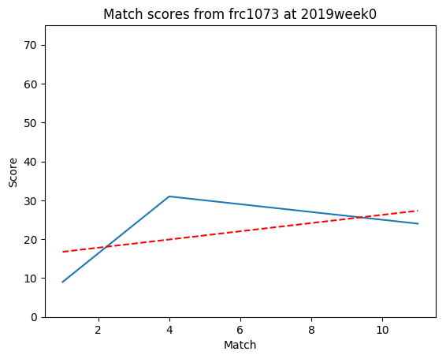

### 1153, The Walpole Revolution

OPR: 15.32822756129525

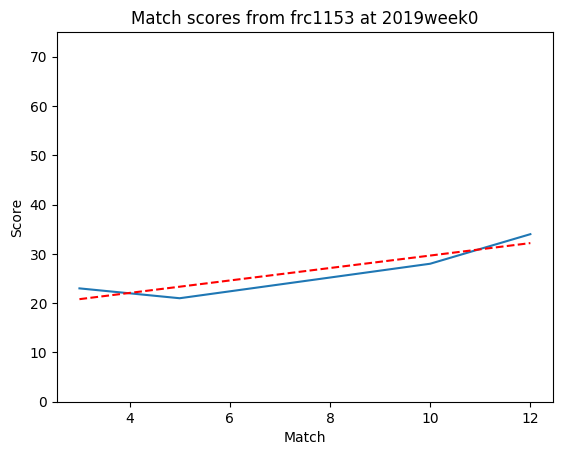

### 1517, The Lumberjacks

OPR: 12.23364293643587

### 1721, Tidal Force

OPR: -0.9741805100379297

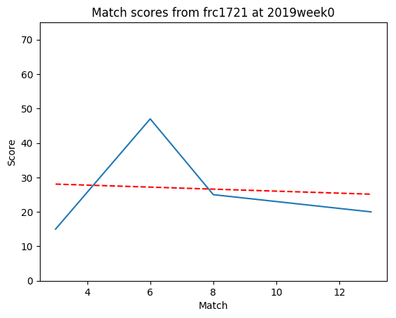

### 1729, Team Inconceivable!

OPR: 19.451682072477084

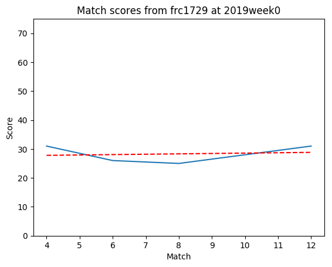

### 190, Gompei and the H.E.R.D.

OPR: -4.0800834566188895

### 2084, Robots by the C

OPR: 7.7334636867642175

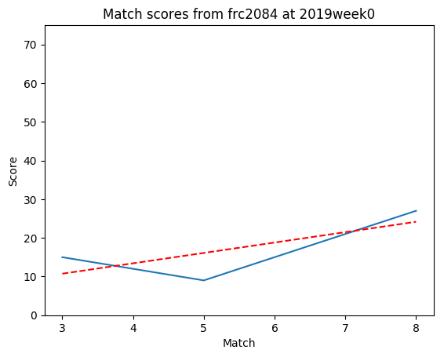

### 2342, Team Phoenix

OPR: 14.536198498181088

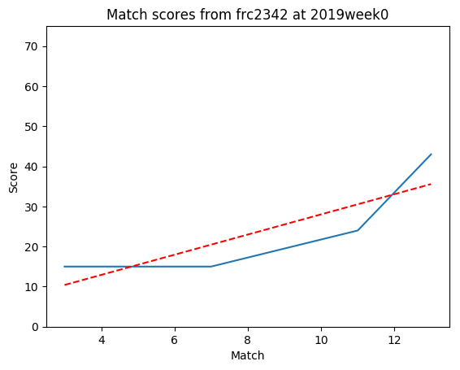

### 246, Overclocked

OPR: 10.578146724215728

### 3236, TRIFORCE

OPR: 24.366797074913954

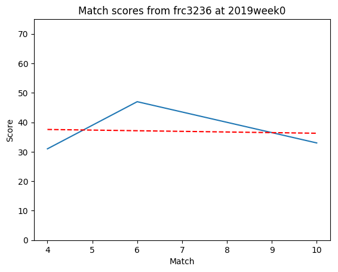

### 3323, Potential Energy

OPR: -9.199718120298636

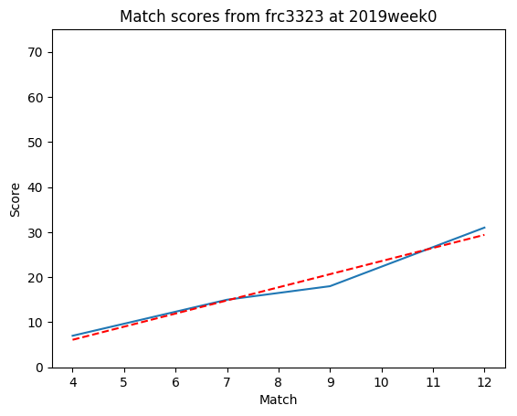

### 3467, Windham Windup

OPR: -0.8983592351164429

### 3986, Express-O

OPR: -7.1396833557292645

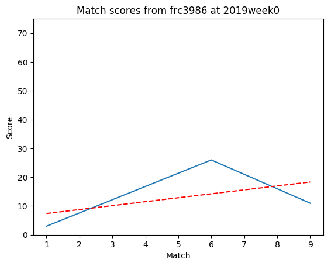

### 4905, Andromeda One

OPR: 1.6000785998847231

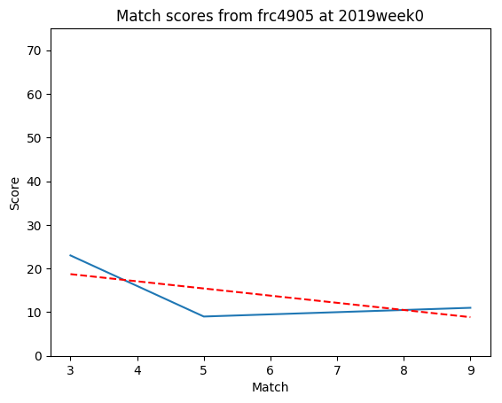

### 501, The PowerKnights

OPR: 18.089533086810256

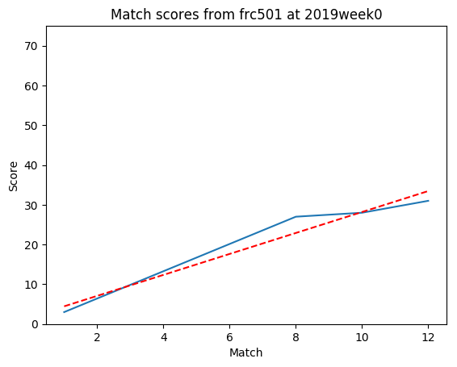

### 509, Red Storm

OPR: -4.553661500014177

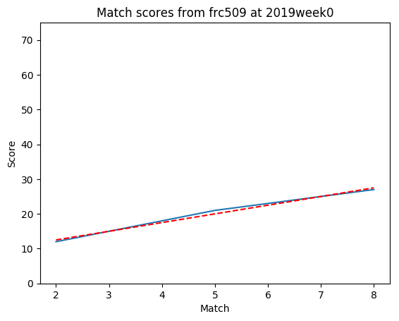

### 5687, The Outliers

OPR: 9.697970504521383

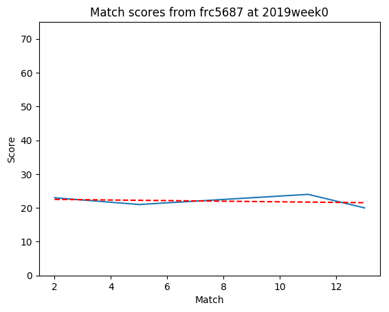

### 58, The Riot Crew

OPR: 18.509498930703106

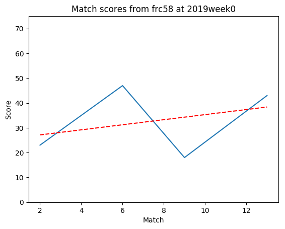

### 5813, Morpheus

OPR: 6.022964548375477

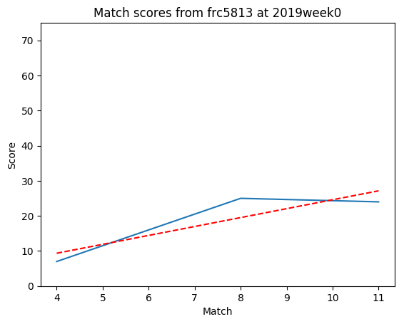

### 6153, Blue Crew

OPR: 10.381377350091016

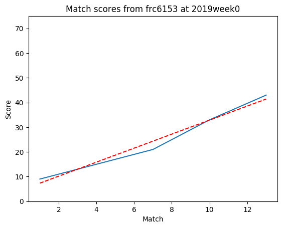

### 7314, Tornados

OPR: 8.37720568399612

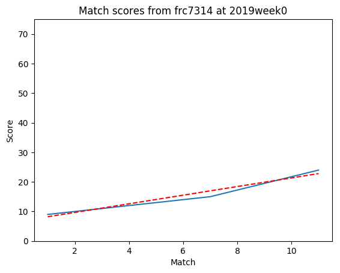

### 811, Cardinals

OPR: 12.597968818916627

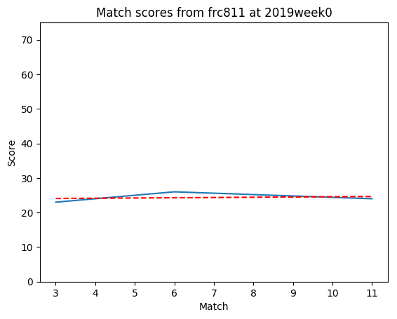