## Welcome

This is intended to be a scouting application for the 2019 FRC game, Destination Deep Space.
It will contain rankings as well as statistics and graphs for various teams competing at FRC competitions.
Don't expect for it to have to many updates except during competitions.
Hopefully most of this will be auto generated as needed to make things easier for me.

Source code can be found [here](https://github.com/morzack/Sakurajima-Scouting).

Message me at @Valis#7360 on Discord for more information.

## How to interpret this

The OPR recorded is extremely useful to see what teams are good overall, however it doesn't really give the full picture when it comes to skill.
I'd recomend pairing the OPR data with qualitative data that determines what it is that a team specializes in.

When interpreting the score graph the easiest thing to look at is the red trendline, as that can show team performance as matches progress.
Obviously a positive slope is good, and any massive dips should be recorded and checked by looking at the OPR.

The team skill breakdown section will be extremely useful when it comes down to picking teams and seeing what they are capable of doing.
At the moment the only things that will be considered automatically are the climb level and opr.
I don't think that there are any other things that can be automatically determined by just using the TBA API yet.
Sakurajima will probably calculate the score achieved in individual categories at some point using similar math to OPR, but that's not happening yet.

## At a Glance

### Overall Competition Stats

**Median match score**: 46.0

**Mean match score**: 44.0

**SD of match scores**: 13.58

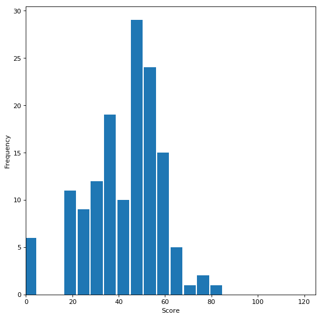

### All teams with OPR and Score P Value

- [Team 2642: Pitt Pirates](#2642-pitt-pirates),&nbsp;&nbsp;&nbsp;&nbsp;20.67,&nbsp;&nbsp;&nbsp;&nbsp;0.74
- [Team 2682: Boneyard Robotics](#2682-boneyard-robotics),&nbsp;&nbsp;&nbsp;&nbsp;22.36,&nbsp;&nbsp;&nbsp;&nbsp;0.55
- [Team 3215: Apollo](#3215-apollo),&nbsp;&nbsp;&nbsp;&nbsp;-0.57,&nbsp;&nbsp;&nbsp;&nbsp;1.0
- [Team 3336: Zimanators](#3336-zimanators),&nbsp;&nbsp;&nbsp;&nbsp;20.25,&nbsp;&nbsp;&nbsp;&nbsp;0.65
- [Team 3661: RoboWolves](#3661-robowolves),&nbsp;&nbsp;&nbsp;&nbsp;6.37,&nbsp;&nbsp;&nbsp;&nbsp;0.98
- [Team 3737: Roto-Raptors](#3737-roto-raptors),&nbsp;&nbsp;&nbsp;&nbsp;17.59,&nbsp;&nbsp;&nbsp;&nbsp;0.86
- [Team 3796: Technical Assassins](#3796-technical-assassins),&nbsp;&nbsp;&nbsp;&nbsp;4.46,&nbsp;&nbsp;&nbsp;&nbsp;0.96
- [Team 3822: Neon Jets](#3822-neon-jets),&nbsp;&nbsp;&nbsp;&nbsp;10.91,&nbsp;&nbsp;&nbsp;&nbsp;0.85
- [Team 4291: AstroBots](#4291-astrobots),&nbsp;&nbsp;&nbsp;&nbsp;13.81,&nbsp;&nbsp;&nbsp;&nbsp;0.94
- [Team 435: Robodogs](#435-robodogs),&nbsp;&nbsp;&nbsp;&nbsp;14.05,&nbsp;&nbsp;&nbsp;&nbsp;0.88
- [Team 4534: Wired Wizards](#4534-wired-wizards),&nbsp;&nbsp;&nbsp;&nbsp;30.07,&nbsp;&nbsp;&nbsp;&nbsp;0.17
- [Team 4795: EastBots](#4795-eastbots),&nbsp;&nbsp;&nbsp;&nbsp;23.81,&nbsp;&nbsp;&nbsp;&nbsp;0.56
- [Team 4816: Gadget Girls](#4816-gadget-girls),&nbsp;&nbsp;&nbsp;&nbsp;4.69,&nbsp;&nbsp;&nbsp;&nbsp;0.99
- [Team 4829: Titanium Tigers](#4829-titanium-tigers),&nbsp;&nbsp;&nbsp;&nbsp;22.1,&nbsp;&nbsp;&nbsp;&nbsp;0.64
- [Team 5160: Chargers](#5160-chargers),&nbsp;&nbsp;&nbsp;&nbsp;15.77,&nbsp;&nbsp;&nbsp;&nbsp;0.77
- [Team 5511: Cortechs Robotics](#5511-cortechs-robotics),&nbsp;&nbsp;&nbsp;&nbsp;25.7,&nbsp;&nbsp;&nbsp;&nbsp;0.53
- [Team 5544: SWIFT Robotics](#5544-swift-robotics),&nbsp;&nbsp;&nbsp;&nbsp;24.85,&nbsp;&nbsp;&nbsp;&nbsp;0.64
- [Team 5607: Team Firewall](#5607-team-firewall),&nbsp;&nbsp;&nbsp;&nbsp;18.83,&nbsp;&nbsp;&nbsp;&nbsp;0.52
- [Team 6004: f(x) Robotics](#6004-fx-robotics),&nbsp;&nbsp;&nbsp;&nbsp;12.65,&nbsp;&nbsp;&nbsp;&nbsp;0.93
- [Team 6214: PHEnix](#6214-phenix),&nbsp;&nbsp;&nbsp;&nbsp;15.45,&nbsp;&nbsp;&nbsp;&nbsp;0.86
- [Team 6215: Armored Eagles](#6215-armored-eagles),&nbsp;&nbsp;&nbsp;&nbsp;3.35,&nbsp;&nbsp;&nbsp;&nbsp;1.0
- [Team 6426: Robo Gladiators](#6426-robo-gladiators),&nbsp;&nbsp;&nbsp;&nbsp;6.13,&nbsp;&nbsp;&nbsp;&nbsp;0.98
- [Team 6500: GearCats](#6500-gearcats),&nbsp;&nbsp;&nbsp;&nbsp;22.17,&nbsp;&nbsp;&nbsp;&nbsp;0.77
- [Team 6512: Coastal CATastrophe](#6512-coastal-catastrophe),&nbsp;&nbsp;&nbsp;&nbsp;8.89,&nbsp;&nbsp;&nbsp;&nbsp;0.95
- [Team 6639: The Mechanical Minds ](#6639-the-mechanical-minds),&nbsp;&nbsp;&nbsp;&nbsp;16.48,&nbsp;&nbsp;&nbsp;&nbsp;0.81
- [Team 6729: RobCoBots](#6729-robcobots),&nbsp;&nbsp;&nbsp;&nbsp;16.06,&nbsp;&nbsp;&nbsp;&nbsp;0.88
- [Team 7029: Scotbotics](#7029-scotbotics),&nbsp;&nbsp;&nbsp;&nbsp;11.82,&nbsp;&nbsp;&nbsp;&nbsp;0.95
- [Team 7265: Skeleton Crew](#7265-skeleton-crew),&nbsp;&nbsp;&nbsp;&nbsp;13.95,&nbsp;&nbsp;&nbsp;&nbsp;0.9
- [Team 7270: Pender Circuit Breakers](#7270-pender-circuit-breakers),&nbsp;&nbsp;&nbsp;&nbsp;7.94,&nbsp;&nbsp;&nbsp;&nbsp;0.96
- [Team 7443: Overhills Jag-Wires](#7443-overhills-jag-wires),&nbsp;&nbsp;&nbsp;&nbsp;18.57,&nbsp;&nbsp;&nbsp;&nbsp;0.73
- [Team 7463: Incandescent Mice](#7463-incandescent-mice),&nbsp;&nbsp;&nbsp;&nbsp;12.3,&nbsp;&nbsp;&nbsp;&nbsp;0.92
- [Team 7671: Fire Hazard](#7671-fire-hazard),&nbsp;&nbsp;&nbsp;&nbsp;21.07,&nbsp;&nbsp;&nbsp;&nbsp;0.82
- [Team 7675: Spark Guardians ](#7675-spark-guardians),&nbsp;&nbsp;&nbsp;&nbsp;11.97,&nbsp;&nbsp;&nbsp;&nbsp;0.87
- [Team 7715: Robo-Banditos](#7715-robo-banditos),&nbsp;&nbsp;&nbsp;&nbsp;9.12,&nbsp;&nbsp;&nbsp;&nbsp;0.92
- [Team 7739: Royal Tech Warriors](#7739-royal-tech-warriors),&nbsp;&nbsp;&nbsp;&nbsp;9.21,&nbsp;&nbsp;&nbsp;&nbsp;0.96
- [Team 7890: SeQuEnCe](#7890-sequence),&nbsp;&nbsp;&nbsp;&nbsp;15.97,&nbsp;&nbsp;&nbsp;&nbsp;0.84

### Points scored per match

### Team skill breakdown

team | opr | z score percentile thing | opr/zs |  low hatch | high hatch | low cargo | high cargo | average climb level
--- | --- | --- | --- | :---: | :---: | :---: | :---: | :---:
[Team 4534: Wired Wizards](#4534-wired-wizards) | 30.07 | 0.17 | 176.88235294117646 |  |  |  |  | 1.917
[Team 5511: Cortechs Robotics](#5511-cortechs-robotics) | 25.7 | 0.53 | 48.490566037735846 | X |  | X |  | 2.583
[Team 5544: SWIFT Robotics](#5544-swift-robotics) | 24.85 | 0.64 | 38.828125 |  |  |  |  | 1.091
[Team 4795: EastBots](#4795-eastbots) | 23.81 | 0.56 | 42.51785714285714 |  |  |  |  | 2.818
[Team 2682: Boneyard Robotics](#2682-boneyard-robotics) | 22.36 | 0.55 | 40.65454545454545 | X | X | X | X | 0.833
[Team 6500: GearCats](#6500-gearcats) | 22.17 | 0.77 | 28.792207792207794 |  |  |  |  | 0.909
[Team 4829: Titanium Tigers](#4829-titanium-tigers) | 22.1 | 0.64 | 34.53125 |  |  |  |  | 1.583
[Team 7671: Fire Hazard](#7671-fire-hazard) | 21.07 | 0.82 | 25.695121951219512 | X |  | X |  | 1.0
[Team 2642: Pitt Pirates](#2642-pitt-pirates) | 20.67 | 0.74 | 27.932432432432435 | X |  | X |  | 0.909
[Team 3336: Zimanators](#3336-zimanators) | 20.25 | 0.65 | 31.153846153846153 |  |  |  |  | 0.909
[Team 5607: Team Firewall](#5607-team-firewall) | 18.83 | 0.52 | 36.21153846153846 |  |  |  |  | 0.833
[Team 7443: Overhills Jag-Wires](#7443-overhills-jag-wires) | 18.57 | 0.73 | 25.438356164383563 |  |  |  |  | 0.917
[Team 3737: Roto-Raptors](#3737-roto-raptors) | 17.59 | 0.86 | 20.453488372093023 | X | X | X | X | 0.909
[Team 6639: The Mechanical Minds ](#6639-the-mechanical-minds) | 16.48 | 0.81 | 20.345679012345677 |  |  |  |  | 0.917
[Team 6729: RobCoBots](#6729-robcobots) | 16.06 | 0.88 | 18.25 |  |  |  |  | 0.727
[Team 7890: SeQuEnCe](#7890-sequence) | 15.97 | 0.84 | 19.011904761904763 |  |  |  |  | 1.727
[Team 5160: Chargers](#5160-chargers) | 15.77 | 0.77 | 20.48051948051948 | X |  | X |  | 0.833
[Team 6214: PHEnix](#6214-phenix) | 15.45 | 0.86 | 17.96511627906977 |  |  |  |  | 0.818
[Team 435: Robodogs](#435-robodogs) | 14.05 | 0.88 | 15.965909090909092 | X |  | X |  | 0.545
[Team 7265: Skeleton Crew](#7265-skeleton-crew) | 13.95 | 0.9 | 15.499999999999998 |  |  |  |  | 0.833
[Team 4291: AstroBots](#4291-astrobots) | 13.81 | 0.94 | 14.691489361702128 | X |  | X |  | 0.818
[Team 6004: f(x) Robotics](#6004-fx-robotics) | 12.65 | 0.93 | 13.602150537634408 |  |  |  |  | 1.273
[Team 7463: Incandescent Mice](#7463-incandescent-mice) | 12.3 | 0.92 | 13.369565217391305 | X |  | X |  | 0.833
[Team 7675: Spark Guardians ](#7675-spark-guardians) | 11.97 | 0.87 | 13.758620689655173 |  |  |  |  | 0.75
[Team 7029: Scotbotics](#7029-scotbotics) | 11.82 | 0.95 | 12.442105263157895 | X |  | X |  | 0.727
[Team 3822: Neon Jets](#3822-neon-jets) | 10.91 | 0.85 | 12.83529411764706 |  |  |  |  | 0.833
[Team 7739: Royal Tech Warriors](#7739-royal-tech-warriors) | 9.21 | 0.96 | 9.593750000000002 |  |  |  |  | 0.545
[Team 7715: Robo-Banditos](#7715-robo-banditos) | 9.12 | 0.92 | 9.913043478260867 |  |  |  |  | 0.667
[Team 6512: Coastal CATastrophe](#6512-coastal-catastrophe) | 8.89 | 0.95 | 9.357894736842105 |  |  |  |  | 0.667
[Team 7270: Pender Circuit Breakers](#7270-pender-circuit-breakers) | 7.94 | 0.96 | 8.270833333333334 |  |  |  |  | 0.5
[Team 3661: RoboWolves](#3661-robowolves) | 6.37 | 0.98 | 6.5 |  |  |  |  | 0.75
[Team 6426: Robo Gladiators](#6426-robo-gladiators) | 6.13 | 0.98 | 6.255102040816326 |  |  |  |  | 0.818
[Team 4816: Gadget Girls](#4816-gadget-girls) | 4.69 | 0.99 | 4.737373737373738 |  |  |  |  | 0.636
[Team 3796: Technical Assassins](#3796-technical-assassins) | 4.46 | 0.96 | 4.645833333333333 |  |  |  |  | 0.5
[Team 6215: Armored Eagles](#6215-armored-eagles) | 3.35 | 1.0 | 3.35 |  |  |  |  | 0.545
[Team 3215: Apollo](#3215-apollo) | -0.57 | 1.0 | -0.57 |  |  |  |  | 0.333

## In depth

### 2642, Pitt Pirates

**OPR**: 20.6732

**P value**: 0.74

**Team Capabilities**:

| low hatch | high hatch | low cargo | high cargo | average climb level |
| :---: | :---: | :---: | :---: | --- |
| X |  | X |  | 0.909 |

[Return to top](#at-a-glance)

---

### 2682, Boneyard Robotics

**OPR**: 22.3602

**P value**: 0.55

**Team Capabilities**:

| low hatch | high hatch | low cargo | high cargo | average climb level |
| :---: | :---: | :---: | :---: | --- |
| X | X | X | X | 0.833 |

[Return to top](#at-a-glance)

---

### 3215, Apollo

**OPR**: -0.5731

**P value**: 1.0

**Team Capabilities**:

| low hatch | high hatch | low cargo | high cargo | average climb level |
| :---: | :---: | :---: | :---: | --- |
|  |  |  |  | 0.333 |

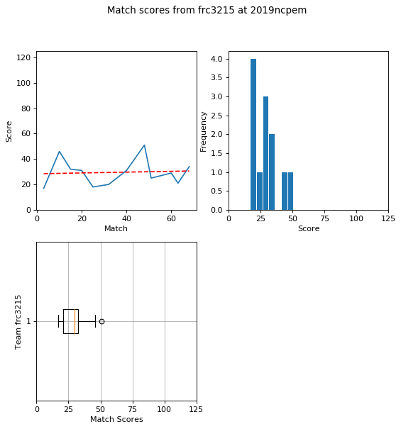

[Return to top](#at-a-glance)

---

### 3336, Zimanators

**OPR**: 20.2459

**P value**: 0.65

**Team Capabilities**:

| low hatch | high hatch | low cargo | high cargo | average climb level |
| :---: | :---: | :---: | :---: | --- |
|  |  |  |  | 0.909 |

[Return to top](#at-a-glance)

---

### 3661, RoboWolves

**OPR**: 6.3713

**P value**: 0.98

**Team Capabilities**:

| low hatch | high hatch | low cargo | high cargo | average climb level |
| :---: | :---: | :---: | :---: | --- |
|  |  |  |  | 0.75 |

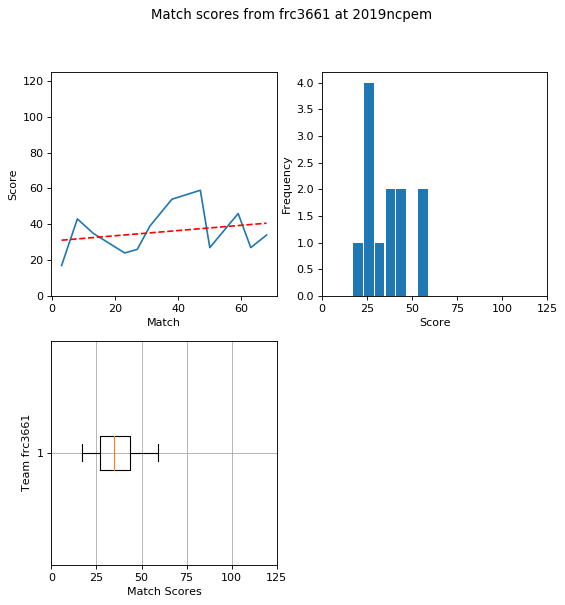

[Return to top](#at-a-glance)

---

### 3737, Roto-Raptors

**OPR**: 17.5912

**P value**: 0.86

**Team Capabilities**:

| low hatch | high hatch | low cargo | high cargo | average climb level |
| :---: | :---: | :---: | :---: | --- |
| X | X | X | X | 0.909 |

[Return to top](#at-a-glance)

---

### 3796, Technical Assassins

**OPR**: 4.458

**P value**: 0.96

**Team Capabilities**:

| low hatch | high hatch | low cargo | high cargo | average climb level |
| :---: | :---: | :---: | :---: | --- |
|  |  |  |  | 0.5 |

[Return to top](#at-a-glance)

---

### 3822, Neon Jets

**OPR**: 10.9112

**P value**: 0.85

**Team Capabilities**:

| low hatch | high hatch | low cargo | high cargo | average climb level |
| :---: | :---: | :---: | :---: | --- |
|  |  |  |  | 0.833 |

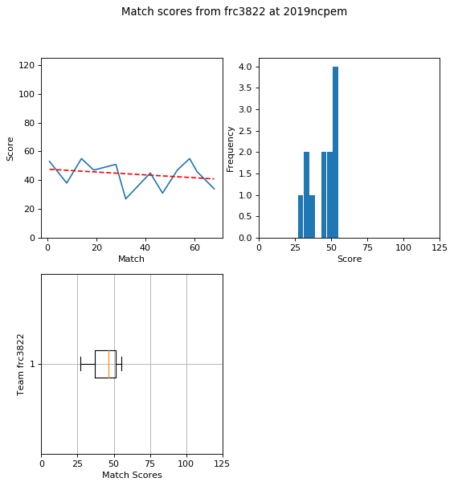

[Return to top](#at-a-glance)

---

### 4291, AstroBots

**OPR**: 13.811

**P value**: 0.94

**Team Capabilities**:

| low hatch | high hatch | low cargo | high cargo | average climb level |
| :---: | :---: | :---: | :---: | --- |
| X |  | X |  | 0.818 |

[Return to top](#at-a-glance)

---

### 435, Robodogs

**OPR**: 14.0474

**P value**: 0.88

**Team Capabilities**:

| low hatch | high hatch | low cargo | high cargo | average climb level |
| :---: | :---: | :---: | :---: | --- |
| X |  | X |  | 0.545 |

[Return to top](#at-a-glance)

---

### 4534, Wired Wizards

**OPR**: 30.0674

**P value**: 0.17

**Team Capabilities**:

| low hatch | high hatch | low cargo | high cargo | average climb level |
| :---: | :---: | :---: | :---: | --- |
|  |  |  |  | 1.917 |

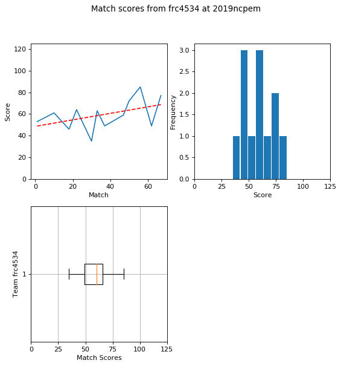

[Return to top](#at-a-glance)

---

### 4795, EastBots

**OPR**: 23.8106

**P value**: 0.56

**Team Capabilities**:

| low hatch | high hatch | low cargo | high cargo | average climb level |
| :---: | :---: | :---: | :---: | --- |
|  |  |  |  | 2.818 |

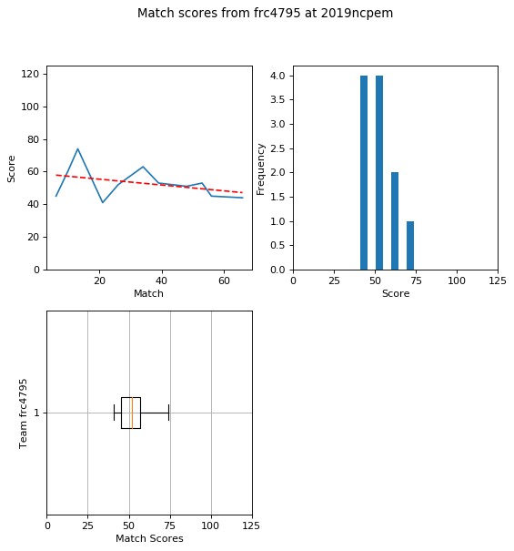

[Return to top](#at-a-glance)

---

### 4816, Gadget Girls

**OPR**: 4.6876

**P value**: 0.99

**Team Capabilities**:

| low hatch | high hatch | low cargo | high cargo | average climb level |
| :---: | :---: | :---: | :---: | --- |
|  |  |  |  | 0.636 |

[Return to top](#at-a-glance)

---

### 4829, Titanium Tigers

**OPR**: 22.0988

**P value**: 0.64

**Team Capabilities**:

| low hatch | high hatch | low cargo | high cargo | average climb level |
| :---: | :---: | :---: | :---: | --- |
|  |  |  |  | 1.583 |

[Return to top](#at-a-glance)

---

### 5160, Chargers

**OPR**: 15.773

**P value**: 0.77

**Team Capabilities**:

| low hatch | high hatch | low cargo | high cargo | average climb level |
| :---: | :---: | :---: | :---: | --- |
| X |  | X |  | 0.833 |

[Return to top](#at-a-glance)

---

### 5511, Cortechs Robotics

**OPR**: 25.7006

**P value**: 0.53

**Team Capabilities**:

| low hatch | high hatch | low cargo | high cargo | average climb level |
| :---: | :---: | :---: | :---: | --- |
| X |  | X |  | 2.583 |

[Return to top](#at-a-glance)

---

### 5544, SWIFT Robotics

**OPR**: 24.8495

**P value**: 0.64

**Team Capabilities**:

| low hatch | high hatch | low cargo | high cargo | average climb level |
| :---: | :---: | :---: | :---: | --- |
|  |  |  |  | 1.091 |

[Return to top](#at-a-glance)

---

### 5607, Team Firewall

**OPR**: 18.8284

**P value**: 0.52

**Team Capabilities**:

| low hatch | high hatch | low cargo | high cargo | average climb level |
| :---: | :---: | :---: | :---: | --- |
|  |  |  |  | 0.833 |

[Return to top](#at-a-glance)

---

### 6004, f(x) Robotics

**OPR**: 12.6463

**P value**: 0.93

**Team Capabilities**:

| low hatch | high hatch | low cargo | high cargo | average climb level |
| :---: | :---: | :---: | :---: | --- |
|  |  |  |  | 1.273 |

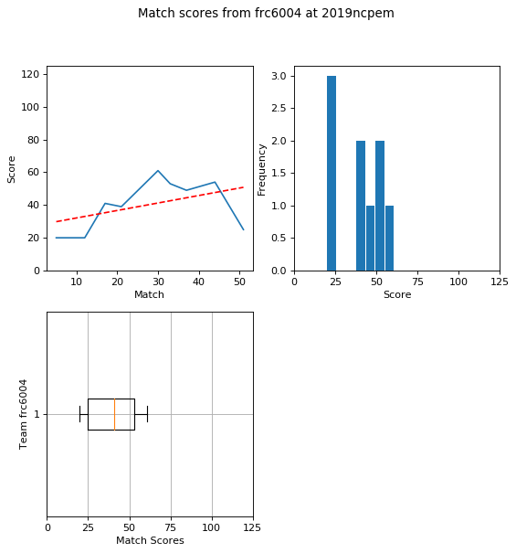

[Return to top](#at-a-glance)

---

### 6214, PHEnix

**OPR**: 15.4483

**P value**: 0.86

**Team Capabilities**:

| low hatch | high hatch | low cargo | high cargo | average climb level |
| :---: | :---: | :---: | :---: | --- |
|  |  |  |  | 0.818 |

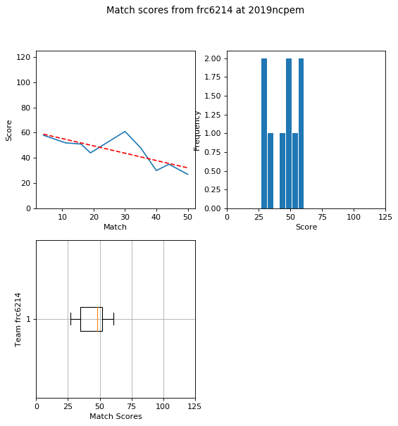

[Return to top](#at-a-glance)

---

### 6215, Armored Eagles

**OPR**: 3.3487

**P value**: 1.0

**Team Capabilities**:

| low hatch | high hatch | low cargo | high cargo | average climb level |
| :---: | :---: | :---: | :---: | --- |
|  |  |  |  | 0.545 |

[Return to top](#at-a-glance)

---

### 6426, Robo Gladiators

**OPR**: 6.1291

**P value**: 0.98

**Team Capabilities**:

| low hatch | high hatch | low cargo | high cargo | average climb level |
| :---: | :---: | :---: | :---: | --- |
|  |  |  |  | 0.818 |

[Return to top](#at-a-glance)

---

### 6500, GearCats

**OPR**: 22.1714

**P value**: 0.77

**Team Capabilities**:

| low hatch | high hatch | low cargo | high cargo | average climb level |
| :---: | :---: | :---: | :---: | --- |
|  |  |  |  | 0.909 |

[Return to top](#at-a-glance)

---

### 6512, Coastal CATastrophe

**OPR**: 8.8891

**P value**: 0.95

**Team Capabilities**:

| low hatch | high hatch | low cargo | high cargo | average climb level |
| :---: | :---: | :---: | :---: | --- |
|  |  |  |  | 0.667 |

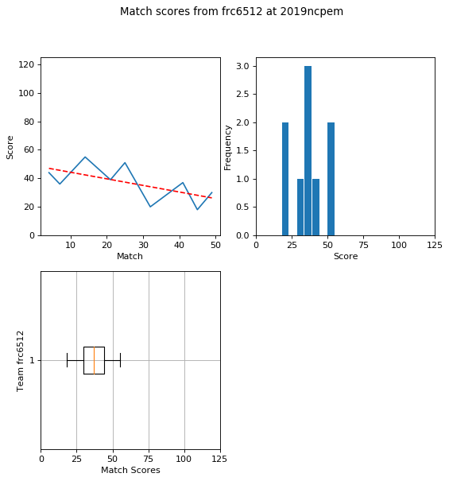

[Return to top](#at-a-glance)

---

### 6639, The Mechanical Minds 

**OPR**: 16.4802

**P value**: 0.81

**Team Capabilities**:

| low hatch | high hatch | low cargo | high cargo | average climb level |
| :---: | :---: | :---: | :---: | --- |
|  |  |  |  | 0.917 |

[Return to top](#at-a-glance)

---

### 6729, RobCoBots

**OPR**: 16.059

**P value**: 0.88

**Team Capabilities**:

| low hatch | high hatch | low cargo | high cargo | average climb level |
| :---: | :---: | :---: | :---: | --- |
|  |  |  |  | 0.727 |

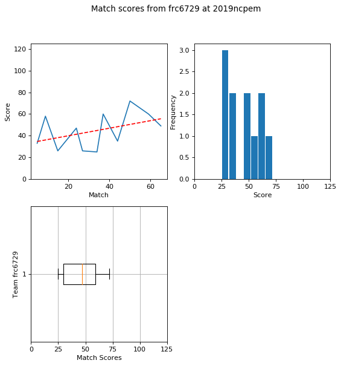

[Return to top](#at-a-glance)

---

### 7029, Scotbotics

**OPR**: 11.8206

**P value**: 0.95

**Team Capabilities**:

| low hatch | high hatch | low cargo | high cargo | average climb level |
| :---: | :---: | :---: | :---: | --- |
| X |  | X |  | 0.727 |

[Return to top](#at-a-glance)

---

### 7265, Skeleton Crew

**OPR**: 13.9498

**P value**: 0.9

**Team Capabilities**:

| low hatch | high hatch | low cargo | high cargo | average climb level |
| :---: | :---: | :---: | :---: | --- |
|  |  |  |  | 0.833 |

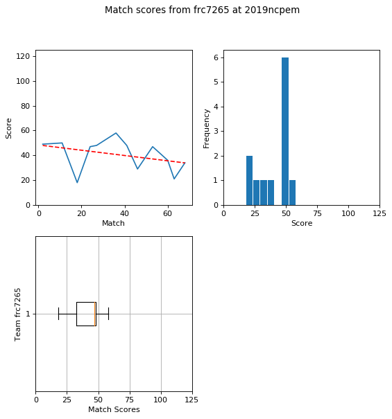

[Return to top](#at-a-glance)

---

### 7270, Pender Circuit Breakers

**OPR**: 7.9431

**P value**: 0.96

**Team Capabilities**:

| low hatch | high hatch | low cargo | high cargo | average climb level |
| :---: | :---: | :---: | :---: | --- |
|  |  |  |  | 0.5 |

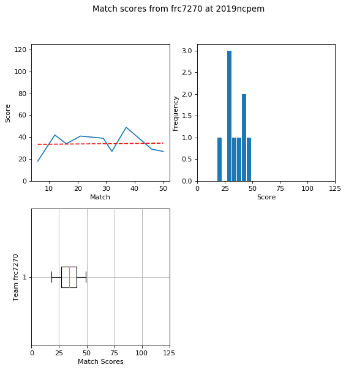

[Return to top](#at-a-glance)

---

### 7443, Overhills Jag-Wires

**OPR**: 18.5723

**P value**: 0.73

**Team Capabilities**:

| low hatch | high hatch | low cargo | high cargo | average climb level |
| :---: | :---: | :---: | :---: | --- |
|  |  |  |  | 0.917 |

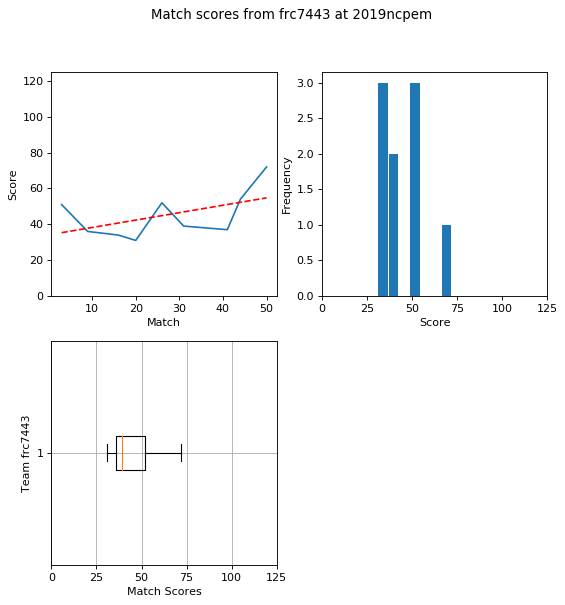

[Return to top](#at-a-glance)

---

### 7463, Incandescent Mice

**OPR**: 12.2972

**P value**: 0.92

**Team Capabilities**:

| low hatch | high hatch | low cargo | high cargo | average climb level |
| :---: | :---: | :---: | :---: | --- |
| X |  | X |  | 0.833 |

[Return to top](#at-a-glance)

---

### 7671, Fire Hazard

**OPR**: 21.0664

**P value**: 0.82

**Team Capabilities**:

| low hatch | high hatch | low cargo | high cargo | average climb level |
| :---: | :---: | :---: | :---: | --- |
| X |  | X |  | 1.0 |

[Return to top](#at-a-glance)

---

### 7675, Spark Guardians 

**OPR**: 11.9659

**P value**: 0.87

**Team Capabilities**:

| low hatch | high hatch | low cargo | high cargo | average climb level |
| :---: | :---: | :---: | :---: | --- |
|  |  |  |  | 0.75 |

[Return to top](#at-a-glance)

---

### 7715, Robo-Banditos

**OPR**: 9.1203

**P value**: 0.92

**Team Capabilities**:

| low hatch | high hatch | low cargo | high cargo | average climb level |
| :---: | :---: | :---: | :---: | --- |
|  |  |  |  | 0.667 |

[Return to top](#at-a-glance)

---

### 7739, Royal Tech Warriors

**OPR**: 9.206

**P value**: 0.96

**Team Capabilities**:

| low hatch | high hatch | low cargo | high cargo | average climb level |
| :---: | :---: | :---: | :---: | --- |
|  |  |  |  | 0.545 |

[Return to top](#at-a-glance)

---

### 7890, SeQuEnCe

**OPR**: 15.9728

**P value**: 0.84

**Team Capabilities**:

| low hatch | high hatch | low cargo | high cargo | average climb level |
| :---: | :---: | :---: | :---: | --- |
|  |  |  |  | 1.727 |

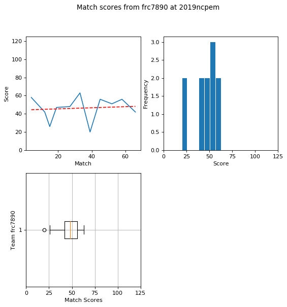

[Return to top](#at-a-glance)

---