## Welcome

This is intended to be a scouting application for the 2019 FRC game, Destination Deep Space.
It will contain rankings as well as statistics and graphs for various teams competing at FRC competitions.
Don't expect for it to have to many updates except during competitions.
Hopefully most of this will be auto generated as needed to make things easier for me.

Source code can be found [here](https://github.com/morzack/Sakurajima-Scouting).

Message me at @Valis#7360 on Discord for more information.

## How to interpret this

The OPR recoreded is extremely useful to see what teams are good overall, however it doesn't really give the full picture when it comes to skill.
I'd reccomend pairing the OPR data with qualitative data that determines what it is that a team specializes in.

When interpreting the score graph the easiest thing to look at is the red trendline, as that can show team performance as matches progress.
Obviously a positive slope is good, and any massive dips should be recorded and checked by looking at the OPR.

The team skill breakdown section will be extremely useful when it comes down to picking teams and seeing what they are capable of doing.
At the moment the only things that will be considered automatically are the climb level and opr.
I don't think that there are any other things that can be automatically determined by just using the TBA API yet.
Sakurajima will probably calculate the score achieved in individual categories at some point using similar math to OPR, but that's not happening yet.

## At a Glance

### All teams with OPR

- [Team 2059: The Hitchhikers](#2059-the-hitchhikers), 13.7475
- [Team 2642: Pitt Pirates](#2642-pitt-pirates), 20.6362
- [Team 2682: Boneyard Robotics](#2682-boneyard-robotics), 20.4098
- [Team 3229: Hawktimus Prime](#3229-hawktimus-prime), 26.529
- [Team 3336: Zimanators](#3336-zimanators), 9.5732
- [Team 3459: Team PyroTech](#3459-team-pyrotech), 6.4215
- [Team 3737: Roto-Raptors](#3737-roto-raptors), 13.6387
- [Team 3796: Technical Assassins](#3796-technical-assassins), 4.8089
- [Team 4291: AstroBots](#4291-astrobots), 9.1455
- [Team 435: Robodogs](#435-robodogs), 9.2375
- [Team 4561: TerrorBytes](#4561-terrorbytes), 23.8167
- [Team 4816: Gadget Girls](#4816-gadget-girls), 4.0232
- [Team 4828: RoboEagles](#4828-roboeagles), -0.591
- [Team 5160: Chargers](#5160-chargers), 7.4807
- [Team 5190: Green Hope Falcons](#5190-green-hope-falcons), 14.8178
- [Team 5511: Cortechs Robotics](#5511-cortechs-robotics), 22.3627
- [Team 5518: Techno Wolves](#5518-techno-wolves), 5.3384
- [Team 5607: Team Firewall](#5607-team-firewall), 12.4202
- [Team 5762: FranklinBots - TEAM HYDRA](#5762-franklinbots---team-hydra), 18.3224
- [Team 5919: JoCo RoBos](#5919-joco-robos), -0.0011
- [Team 6215: Armored Eagles](#6215-armored-eagles), 2.3465
- [Team 6240: Eagles of the Knight](#6240-eagles-of-the-knight), -3.1443
- [Team 6332: Bull City Botics](#6332-bull-city-botics), 6.8844
- [Team 6426: Robo Gladiators](#6426-robo-gladiators), 16.3474
- [Team 6500: GearCats](#6500-gearcats), 12.5921
- [Team 6502: DARC SIDE](#6502-darc-side), 4.1721
- [Team 6565: Team Bobcat](#6565-team-bobcat), 7.2157
- [Team 6908: Infuzed](#6908-infuzed), 17.8953
- [Team 7029: Scotbotics](#7029-scotbotics), 0.2216
- [Team 7463: Incandescent Mice](#7463-incandescent-mice), 7.7162
- [Team 7671: Fire Hazard](#7671-fire-hazard), 6.1438
- [Team 7675: Spark Guardians ](#7675-spark-guardians), 20.063
- [Team 7715: Robo-Banditos](#7715-robo-banditos), 2.4048
- [Team 7739: Royal Tech Warriors](#7739-royal-tech-warriors), 3.8379
- [Team 7763: CARRBOROBOTICS](#7763-carrborobotics), 14.7298
- [Team 900: The Zebracorns](#900-the-zebracorns), 16.1285

### Points scored per match

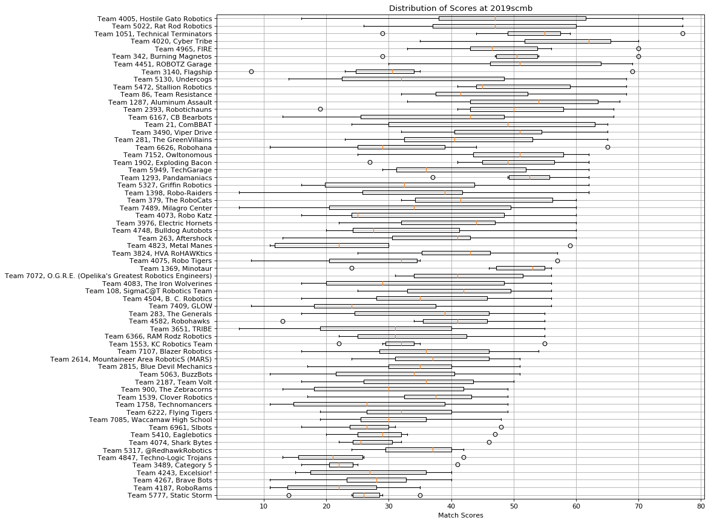

### Team skill breakdown

team | opr | low hatch | high hatch | low cargo | high cargo | average climb level
--- | --- | :---: | :---: | :---: | :---: | :---:
[Team 3229: Hawktimus Prime](#3229-hawktimus-prime) | 26.529 |  |  |  |  | 1.125
[Team 4561: TerrorBytes](#4561-terrorbytes) | 23.8167 |  |  |  |  | 1.0
[Team 5511: Cortechs Robotics](#5511-cortechs-robotics) | 22.3627 |  |  |  |  | 2.625
[Team 2642: Pitt Pirates](#2642-pitt-pirates) | 20.6362 |  |  |  |  | 0.714
[Team 2682: Boneyard Robotics](#2682-boneyard-robotics) | 20.4098 |  |  |  |  | 0.875
[Team 7675: Spark Guardians ](#7675-spark-guardians) | 20.063 |  |  |  |  | 0.625
[Team 5762: FranklinBots - TEAM HYDRA](#5762-franklinbots---team-hydra) | 18.3224 |  |  |  |  | 1.0
[Team 6908: Infuzed](#6908-infuzed) | 17.8953 |  |  |  |  | 0.75
[Team 6426: Robo Gladiators](#6426-robo-gladiators) | 16.3474 |  |  |  |  | 0.625
[Team 900: The Zebracorns](#900-the-zebracorns) | 16.1285 |  |  |  |  | 1.0
[Team 5190: Green Hope Falcons](#5190-green-hope-falcons) | 14.8178 |  |  |  |  | 0.857
[Team 7763: CARRBOROBOTICS](#7763-carrborobotics) | 14.7298 |  |  |  |  | 0.75
[Team 2059: The Hitchhikers](#2059-the-hitchhikers) | 13.7475 |  |  |  |  | 1.286
[Team 3737: Roto-Raptors](#3737-roto-raptors) | 13.6387 |  |  |  |  | 0.625
[Team 6500: GearCats](#6500-gearcats) | 12.5921 |  |  |  |  | 0.375
[Team 5607: Team Firewall](#5607-team-firewall) | 12.4202 |  |  |  |  | 0.75
[Team 3336: Zimanators](#3336-zimanators) | 9.5732 |  |  |  |  | 0.75
[Team 435: Robodogs](#435-robodogs) | 9.2375 |  |  |  |  | 0.5
[Team 4291: AstroBots](#4291-astrobots) | 9.1455 |  |  |  |  | 0.375
[Team 7463: Incandescent Mice](#7463-incandescent-mice) | 7.7162 |  |  |  |  | 0.429
[Team 5160: Chargers](#5160-chargers) | 7.4807 |  |  |  |  | 0.875
[Team 6565: Team Bobcat](#6565-team-bobcat) | 7.2157 |  |  |  |  | 1.0
[Team 6332: Bull City Botics](#6332-bull-city-botics) | 6.8844 |  |  |  |  | 0.5
[Team 3459: Team PyroTech](#3459-team-pyrotech) | 6.4215 |  |  |  |  | 0.75
[Team 7671: Fire Hazard](#7671-fire-hazard) | 6.1438 |  |  |  |  | 0.857
[Team 5518: Techno Wolves](#5518-techno-wolves) | 5.3384 |  |  |  |  | 0.75
[Team 3796: Technical Assassins](#3796-technical-assassins) | 4.8089 |  |  |  |  | 0.375
[Team 6502: DARC SIDE](#6502-darc-side) | 4.1721 |  |  |  |  | 0.5
[Team 4816: Gadget Girls](#4816-gadget-girls) | 4.0232 |  |  |  |  | 0.143
[Team 7739: Royal Tech Warriors](#7739-royal-tech-warriors) | 3.8379 |  |  |  |  | 0.125
[Team 7715: Robo-Banditos](#7715-robo-banditos) | 2.4048 |  |  |  |  | 0.25
[Team 6215: Armored Eagles](#6215-armored-eagles) | 2.3465 |  |  |  |  | 0.5
[Team 7029: Scotbotics](#7029-scotbotics) | 0.2216 |  |  |  |  | 0.5
[Team 5919: JoCo RoBos](#5919-joco-robos) | -0.0011 |  |  |  |  | 0.375
[Team 4828: RoboEagles](#4828-roboeagles) | -0.591 |  |  |  |  | 1.25
[Team 6240: Eagles of the Knight](#6240-eagles-of-the-knight) | -3.1443 |  |  |  |  | 0.25

## In depth

### 2059, The Hitchhikers

**OPR**: 13.7475

**Team Capabilities**:

| low hatch | high hatch | low cargo | high cargo | average climb level |
| :---: | :---: | :---: | :---: | --- |
|  |  |  |  | 1.286 |

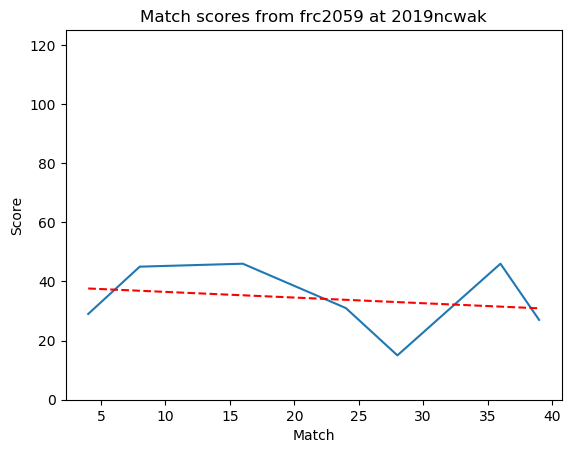

[Return to top](#at-a-glance)

### 2642, Pitt Pirates

**OPR**: 20.6362

**Team Capabilities**:

| low hatch | high hatch | low cargo | high cargo | average climb level |
| :---: | :---: | :---: | :---: | --- |
|  |  |  |  | 0.714 |

[Return to top](#at-a-glance)

### 2682, Boneyard Robotics

**OPR**: 20.4098

**Team Capabilities**:

| low hatch | high hatch | low cargo | high cargo | average climb level |
| :---: | :---: | :---: | :---: | --- |
|  |  |  |  | 0.875 |

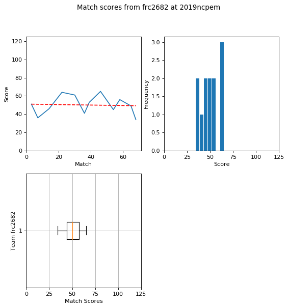

[Return to top](#at-a-glance)

### 3229, Hawktimus Prime

**OPR**: 26.529

**Team Capabilities**:

| low hatch | high hatch | low cargo | high cargo | average climb level |
| :---: | :---: | :---: | :---: | --- |
|  |  |  |  | 1.125 |

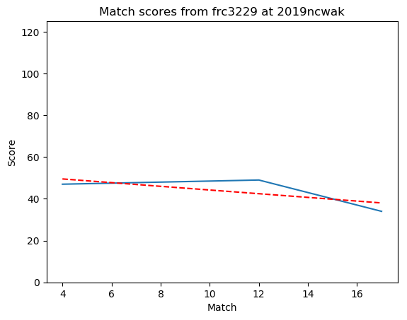

[Return to top](#at-a-glance)

### 3336, Zimanators

**OPR**: 9.5732

**Team Capabilities**:

| low hatch | high hatch | low cargo | high cargo | average climb level |
| :---: | :---: | :---: | :---: | --- |
|  |  |  |  | 0.75 |

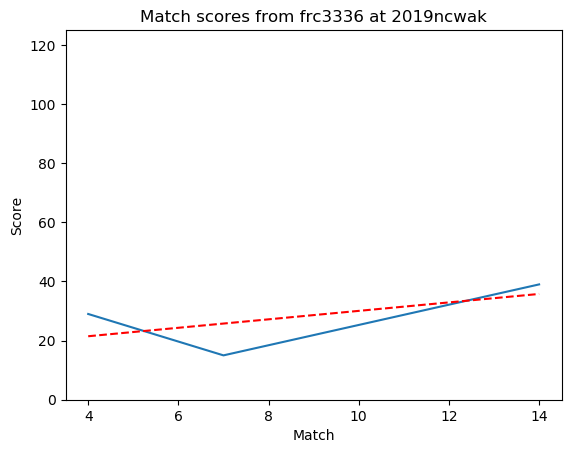

[Return to top](#at-a-glance)

### 3459, Team PyroTech

**OPR**: 6.4215

**Team Capabilities**:

| low hatch | high hatch | low cargo | high cargo | average climb level |
| :---: | :---: | :---: | :---: | --- |
|  |  |  |  | 0.75 |

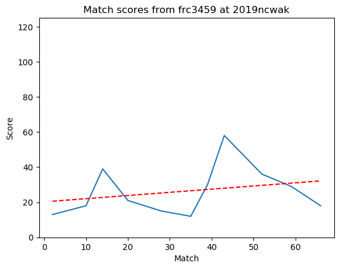

[Return to top](#at-a-glance)

### 3737, Roto-Raptors

**OPR**: 13.6387

**Team Capabilities**:

| low hatch | high hatch | low cargo | high cargo | average climb level |
| :---: | :---: | :---: | :---: | --- |
|  |  |  |  | 0.625 |

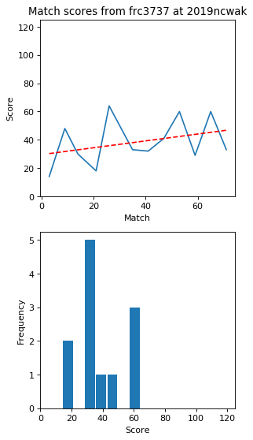

[Return to top](#at-a-glance)

### 3796, Technical Assassins

**OPR**: 4.8089

**Team Capabilities**:

| low hatch | high hatch | low cargo | high cargo | average climb level |
| :---: | :---: | :---: | :---: | --- |
|  |  |  |  | 0.375 |

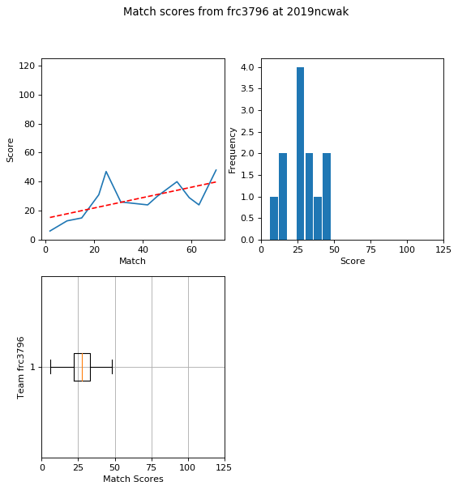

[Return to top](#at-a-glance)

### 4291, AstroBots

**OPR**: 9.1455

**Team Capabilities**:

| low hatch | high hatch | low cargo | high cargo | average climb level |
| :---: | :---: | :---: | :---: | --- |
|  |  |  |  | 0.375 |

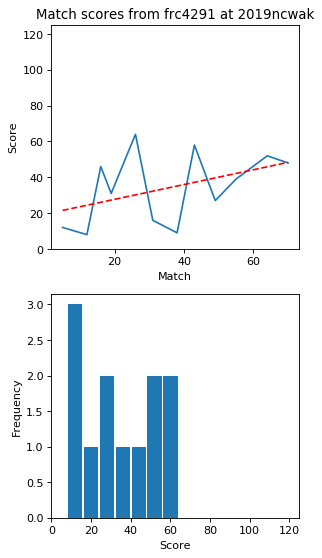

[Return to top](#at-a-glance)

### 435, Robodogs

**OPR**: 9.2375

**Team Capabilities**:

| low hatch | high hatch | low cargo | high cargo | average climb level |
| :---: | :---: | :---: | :---: | --- |
|  |  |  |  | 0.5 |

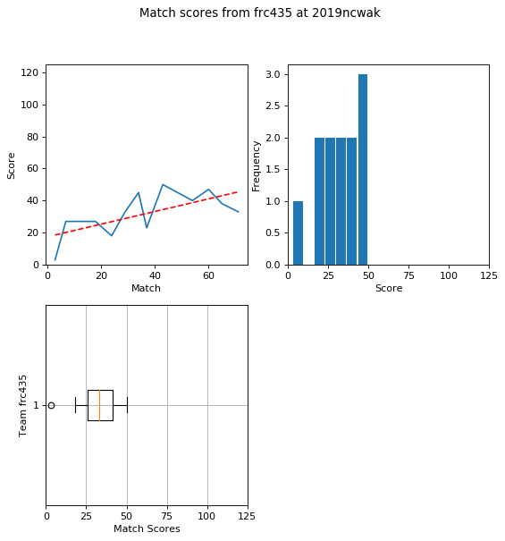

[Return to top](#at-a-glance)

### 4561, TerrorBytes

**OPR**: 23.8167

**Team Capabilities**:

| low hatch | high hatch | low cargo | high cargo | average climb level |
| :---: | :---: | :---: | :---: | --- |
|  |  |  |  | 1.0 |

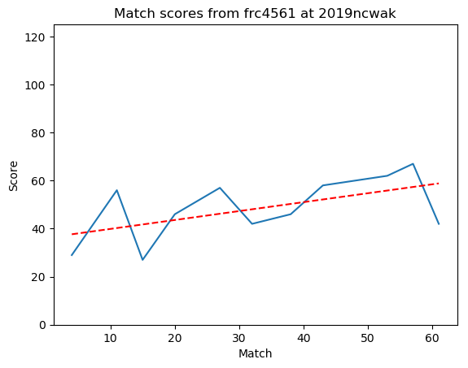

[Return to top](#at-a-glance)

### 4816, Gadget Girls

**OPR**: 4.0232

**Team Capabilities**:

| low hatch | high hatch | low cargo | high cargo | average climb level |
| :---: | :---: | :---: | :---: | --- |
|  |  |  |  | 0.143 |

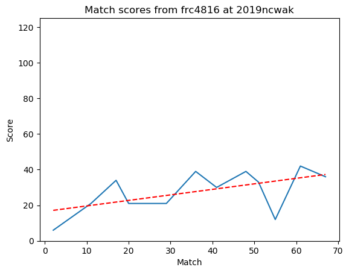

[Return to top](#at-a-glance)

### 4828, RoboEagles

**OPR**: -0.591

**Team Capabilities**:

| low hatch | high hatch | low cargo | high cargo | average climb level |
| :---: | :---: | :---: | :---: | --- |
|  |  |  |  | 1.25 |

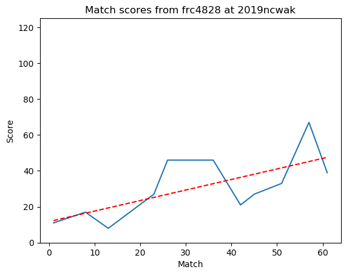

[Return to top](#at-a-glance)

### 5160, Chargers

**OPR**: 7.4807

**Team Capabilities**:

| low hatch | high hatch | low cargo | high cargo | average climb level |
| :---: | :---: | :---: | :---: | --- |
|  |  |  |  | 0.875 |

[Return to top](#at-a-glance)

### 5190, Green Hope Falcons

**OPR**: 14.8178

**Team Capabilities**:

| low hatch | high hatch | low cargo | high cargo | average climb level |
| :---: | :---: | :---: | :---: | --- |
|  |  |  |  | 0.857 |

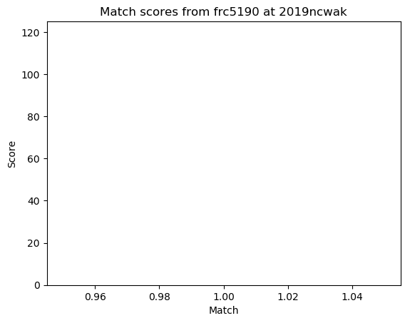

[Return to top](#at-a-glance)

### 5511, Cortechs Robotics

**OPR**: 22.3627

**Team Capabilities**:

| low hatch | high hatch | low cargo | high cargo | average climb level |
| :---: | :---: | :---: | :---: | --- |
|  |  |  |  | 2.625 |

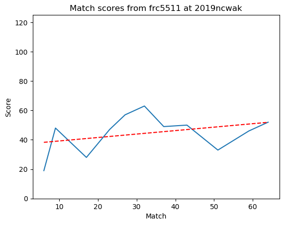

[Return to top](#at-a-glance)

### 5518, Techno Wolves

**OPR**: 5.3384

**Team Capabilities**:

| low hatch | high hatch | low cargo | high cargo | average climb level |
| :---: | :---: | :---: | :---: | --- |
|  |  |  |  | 0.75 |

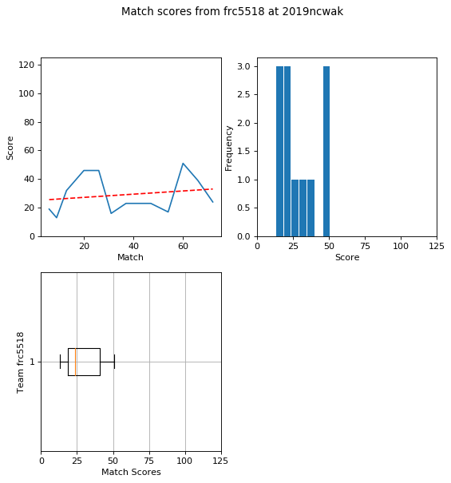

[Return to top](#at-a-glance)

### 5607, Team Firewall

**OPR**: 12.4202

**Team Capabilities**:

| low hatch | high hatch | low cargo | high cargo | average climb level |
| :---: | :---: | :---: | :---: | --- |
|  |  |  |  | 0.75 |

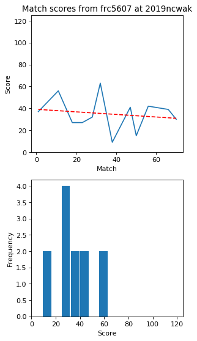

[Return to top](#at-a-glance)

### 5762, FranklinBots - TEAM HYDRA

**OPR**: 18.3224

**Team Capabilities**:

| low hatch | high hatch | low cargo | high cargo | average climb level |
| :---: | :---: | :---: | :---: | --- |
|  |  |  |  | 1.0 |

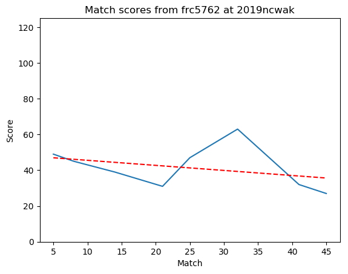

[Return to top](#at-a-glance)

### 5919, JoCo RoBos

**OPR**: -0.0011

**Team Capabilities**:

| low hatch | high hatch | low cargo | high cargo | average climb level |
| :---: | :---: | :---: | :---: | --- |
|  |  |  |  | 0.375 |

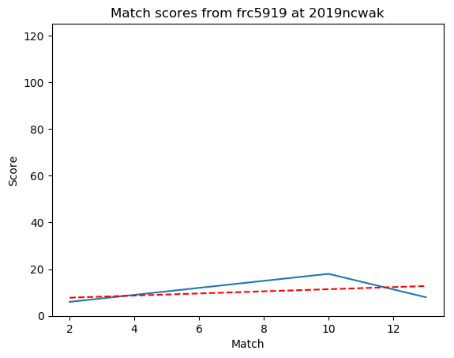

[Return to top](#at-a-glance)

### 6215, Armored Eagles

**OPR**: 2.3465

**Team Capabilities**:

| low hatch | high hatch | low cargo | high cargo | average climb level |
| :---: | :---: | :---: | :---: | --- |
|  |  |  |  | 0.5 |

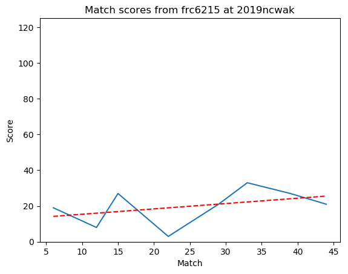

[Return to top](#at-a-glance)

### 6240, Eagles of the Knight

**OPR**: -3.1443

**Team Capabilities**:

| low hatch | high hatch | low cargo | high cargo | average climb level |
| :---: | :---: | :---: | :---: | --- |
|  |  |  |  | 0.25 |

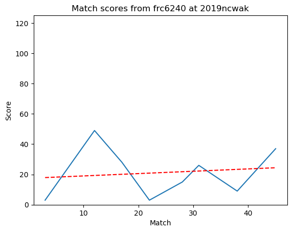

[Return to top](#at-a-glance)

### 6332, Bull City Botics

**OPR**: 6.8844

**Team Capabilities**:

| low hatch | high hatch | low cargo | high cargo | average climb level |
| :---: | :---: | :---: | :---: | --- |
|  |  |  |  | 0.5 |

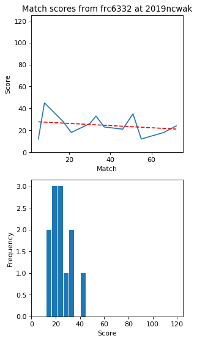

[Return to top](#at-a-glance)

### 6426, Robo Gladiators

**OPR**: 16.3474

**Team Capabilities**:

| low hatch | high hatch | low cargo | high cargo | average climb level |
| :---: | :---: | :---: | :---: | --- |
|  |  |  |  | 0.625 |

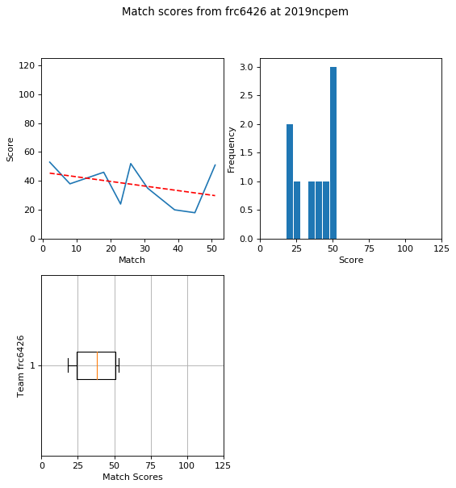

[Return to top](#at-a-glance)

### 6500, GearCats

**OPR**: 12.5921

**Team Capabilities**:

| low hatch | high hatch | low cargo | high cargo | average climb level |
| :---: | :---: | :---: | :---: | --- |
|  |  |  |  | 0.375 |

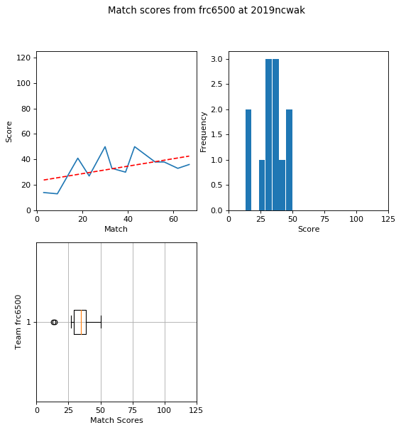

[Return to top](#at-a-glance)

### 6502, DARC SIDE

**OPR**: 4.1721

**Team Capabilities**:

| low hatch | high hatch | low cargo | high cargo | average climb level |
| :---: | :---: | :---: | :---: | --- |
|  |  |  |  | 0.5 |

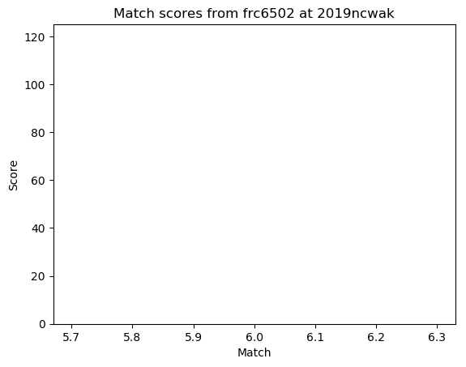

[Return to top](#at-a-glance)

### 6565, Team Bobcat

**OPR**: 7.2157

**Team Capabilities**:

| low hatch | high hatch | low cargo | high cargo | average climb level |
| :---: | :---: | :---: | :---: | --- |
|  |  |  |  | 1.0 |

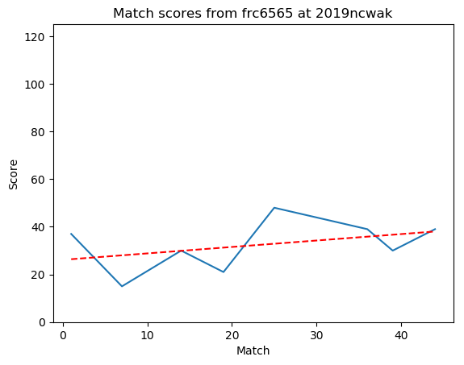

[Return to top](#at-a-glance)

### 6908, Infuzed

**OPR**: 17.8953

**Team Capabilities**:

| low hatch | high hatch | low cargo | high cargo | average climb level |
| :---: | :---: | :---: | :---: | --- |
|  |  |  |  | 0.75 |

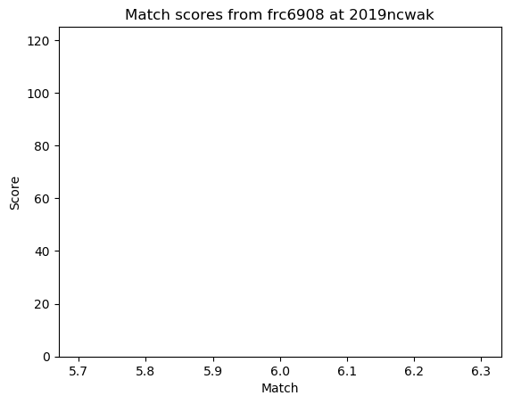

[Return to top](#at-a-glance)

### 7029, Scotbotics

**OPR**: 0.2216

**Team Capabilities**:

| low hatch | high hatch | low cargo | high cargo | average climb level |
| :---: | :---: | :---: | :---: | --- |
|  |  |  |  | 0.5 |

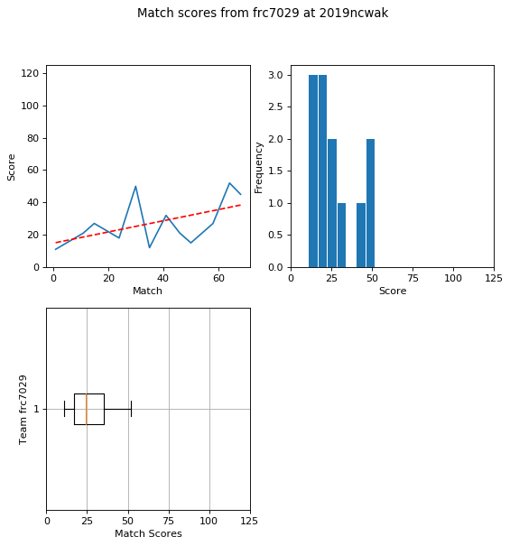

[Return to top](#at-a-glance)

### 7463, Incandescent Mice

**OPR**: 7.7162

**Team Capabilities**:

| low hatch | high hatch | low cargo | high cargo | average climb level |
| :---: | :---: | :---: | :---: | --- |
|  |  |  |  | 0.429 |

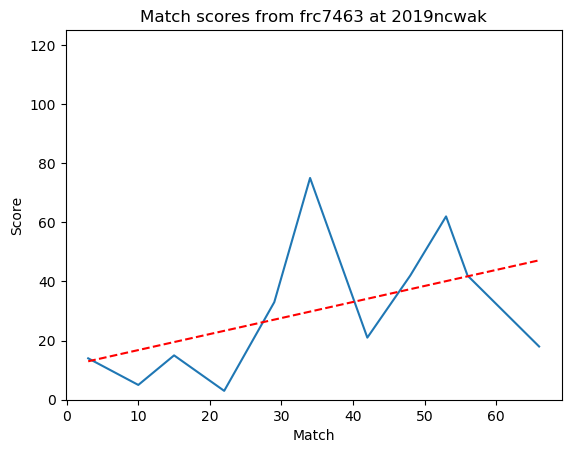

[Return to top](#at-a-glance)

### 7671, Fire Hazard

**OPR**: 6.1438

**Team Capabilities**:

| low hatch | high hatch | low cargo | high cargo | average climb level |
| :---: | :---: | :---: | :---: | --- |
|  |  |  |  | 0.857 |

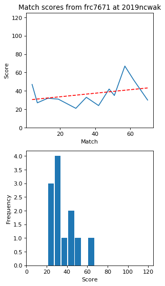

[Return to top](#at-a-glance)

### 7675, Spark Guardians 

**OPR**: 20.063

**Team Capabilities**:

| low hatch | high hatch | low cargo | high cargo | average climb level |
| :---: | :---: | :---: | :---: | --- |
|  |  |  |  | 0.625 |

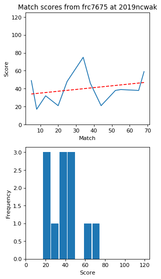

[Return to top](#at-a-glance)

### 7715, Robo-Banditos

**OPR**: 2.4048

**Team Capabilities**:

| low hatch | high hatch | low cargo | high cargo | average climb level |
| :---: | :---: | :---: | :---: | --- |
|  |  |  |  | 0.25 |

[Return to top](#at-a-glance)

### 7739, Royal Tech Warriors

**OPR**: 3.8379

**Team Capabilities**:

| low hatch | high hatch | low cargo | high cargo | average climb level |
| :---: | :---: | :---: | :---: | --- |
|  |  |  |  | 0.125 |

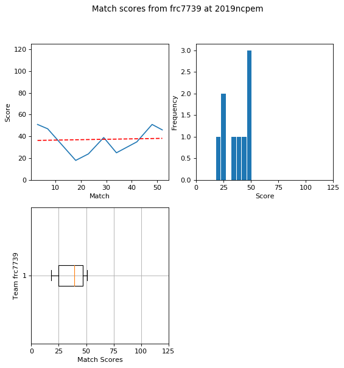

[Return to top](#at-a-glance)

### 7763, CARRBOROBOTICS

**OPR**: 14.7298

**Team Capabilities**:

| low hatch | high hatch | low cargo | high cargo | average climb level |
| :---: | :---: | :---: | :---: | --- |
|  |  |  |  | 0.75 |

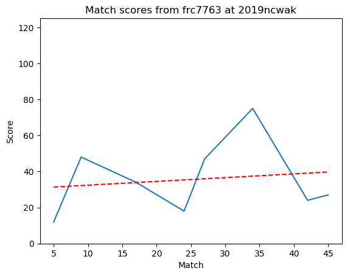

[Return to top](#at-a-glance)

### 900, The Zebracorns

**OPR**: 16.1285

**Team Capabilities**:

| low hatch | high hatch | low cargo | high cargo | average climb level |
| :---: | :---: | :---: | :---: | --- |
|  |  |  |  | 1.0 |

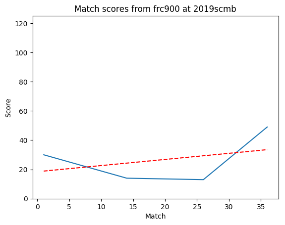

[Return to top](#at-a-glance)