## Welcome

This is intended to be a scouting application for the 2019 FRC game, Destination Deep Space.
It will contain rankings as well as statistics and graphs for various teams competing at FRC competitions.
Don't expect for it to have to many updates except during competitions.
Hopefully most of this will be auto generated as needed to make things easier for me.

Source code can be found [here](https://github.com/morzack/Sakurajima-Scouting).

Message me at @Valis#7360 on Discord for more information.

## How to interpret this

The OPR recoreded is extremely useful to see what teams are good overall, however it doesn't really give the full picture when it comes to skill.
I'd reccomend pairing the OPR data with qualitative data that determines what it is that a team specializes in.

When interpreting the score graph the easiest thing to look at is the red trendline, as that can show team performance as matches progress.
Obviously a positive slope is good, and any massive dips should be recorded and checked by looking at the OPR.

The team skill breakdown section will be extremely useful when it comes down to picking teams and seeing what they are capable of doing.
At the moment the only things that will be considered automatically are the climb level and opr.
I don't think that there are any other things that can be automatically determined by just using the TBA API yet.
Sakurajima will probably calculate the score achieved in individual categories at some point using similar math to OPR, but that's not happening yet.

## At a Glance

### All teams with OPR

- [Team 1051: Technical Terminators](#1051-technical-terminators), 21.2774
- [Team 108: SigmaC@T Robotics Team](#108-sigmact-robotics-team), 19.6217
- [Team 1287: Aluminum Assault](#1287-aluminum-assault), 17.7986
- [Team 1293: Pandamaniacs](#1293-pandamaniacs), 22.9621
- [Team 1369: Minotaur](#1369-minotaur), 18.4528
- [Team 1398: Robo-Raiders](#1398-robo-raiders), 11.9598
- [Team 1539: Clover Robotics](#1539-clover-robotics), 13.3009
- [Team 1553: KC Robotics Team](#1553-kc-robotics-team), 9.0401
- [Team 1758: Technomancers](#1758-technomancers), 2.1269
- [Team 1902: Exploding Bacon](#1902-exploding-bacon), 23.2361
- [Team 21: ComBBAT](#21-combbat), 20.5214
- [Team 2187: Team Volt](#2187-team-volt), 10.0629
- [Team 2393: Robotichauns](#2393-robotichauns), 20.4503
- [Team 2614: Mountaineer Area RoboticS (MARS)](#2614-mountaineer-area-robotics-mars), 13.9302
- [Team 263: Aftershock](#263-aftershock), 15.2929
- [Team 281: The GreenVillains](#281-the-greenvillains), 19.1302
- [Team 2815: Blue Devil Mechanics](#2815-blue-devil-mechanics), 10.6411
- [Team 283: The Generals](#283-the-generals), 5.6826
- [Team 3140: Flagship](#3140-flagship), 14.4384
- [Team 342: Burning Magnetos](#342-burning-magnetos), 22.2663
- [Team 3489: Category 5](#3489-category-5), 8.9369
- [Team 3490: Viper Drive](#3490-viper-drive), 19.9782
- [Team 3651: TRIBE](#3651-tribe), 3.7509
- [Team 379: The RoboCats](#379-the-robocats), 27.2649
- [Team 3824: HVA RoHAWKtics](#3824-hva-rohawktics), 16.1357
- [Team 3976: Electric Hornets](#3976-electric-hornets), 9.9877
- [Team 4005: Hostile Gato Robotics](#4005-hostile-gato-robotics), 25.7193
- [Team 4020: Cyber Tribe](#4020-cyber-tribe), 27.3034
- [Team 4073: Robo Katz](#4073-robo-katz), 10.7318
- [Team 4074: Shark Bytes](#4074-shark-bytes), 4.8163
- [Team 4075: Robo Tigers](#4075-robo-tigers), 2.8304
- [Team 4083: The Iron Wolverines](#4083-the-iron-wolverines), 3.8395
- [Team 4187: RoboRams](#4187-roborams), 4.7473
- [Team 4243: Excelsior!](#4243-excelsior), 0.4606
- [Team 4267: Brave Bots](#4267-brave-bots), 4.0306
- [Team 4451: ROBOTZ Garage](#4451-robotz-garage), 26.9911
- [Team 4504: B. C. Robotics](#4504-b-c-robotics), 12.8325
- [Team 4582: Robohawks ](#4582-robohawks), 16.3074
- [Team 4748: Bulldog Autobots](#4748-bulldog-autobots), 11.8185
- [Team 4823: Metal Manes](#4823-metal-manes), 3.2635
- [Team 4847: Techno-Logic Trojans](#4847-techno-logic-trojans), 1.0112
- [Team 4965: FIRE](#4965-fire), 17.8511
- [Team 5022: Rat Rod Robotics](#5022-rat-rod-robotics), 14.9021
- [Team 5063: BuzzBots](#5063-buzzbots), 3.568
- [Team 5130: Undercogs](#5130-undercogs), 8.4575
- [Team 5317: @RedhawkRobotics](#5317-redhawkrobotics), 14.4317
- [Team 5327: Griffin Robotics](#5327-griffin-robotics), 5.5503
- [Team 5410: Eaglebotics](#5410-eaglebotics), 8.8751
- [Team 5472: Stallion Robotics](#5472-stallion-robotics), 22.1467
- [Team 5777: Static Storm](#5777-static-storm), 2.1599
- [Team 5949: TechGarage](#5949-techgarage), 21.2554
- [Team 6167: CB Bearbots](#6167-cb-bearbots), 10.0957
- [Team 6222: Flying Tigers](#6222-flying-tigers), 10.3232
- [Team 6366: RAM Rodz Robotics](#6366-ram-rodz-robotics), 14.2034
- [Team 6626: Robohana](#6626-robohana), 12.7299
- [Team 6961: SIbots](#6961-sibots), 4.3674
- [Team 7072: O.G.R.E. (Opelika's Greatest Robotics Engineers)](#7072-ogre-opelikas-greatest-robotics-engineers), 19.366
- [Team 7085: Waccamaw High School](#7085-waccamaw-high-school), 12.444
- [Team 7107: Blazer Robotics](#7107-blazer-robotics), 7.0363
- [Team 7152: Owltonomous](#7152-owltonomous), 21.2045
- [Team 7409: GLOW](#7409-glow), 10.5786
- [Team 7489: Milagro Center](#7489-milagro-center), 6.7695
- [Team 86: Team Resistance](#86-team-resistance), 25.7432
- [Team 900: The Zebracorns](#900-the-zebracorns), 8.2121

### Points scored per match

### Team skill breakdown

team | opr | low hatch | low cargo | high hatch | high cargo | average climb level
--- | --- | :---: | :---: | :---: | :---: | :---:
[Team 4020: Cyber Tribe](#4020-cyber-tribe) | 27.3034 |  |  |  |  | 2.688
[Team 379: The RoboCats](#379-the-robocats) | 27.2649 |  |  |  |  | 2.278
[Team 4451: ROBOTZ Garage](#4451-robotz-garage) | 26.9911 |  |  |  |  | 1.812
[Team 86: Team Resistance](#86-team-resistance) | 25.7432 |  |  |  |  | 1.857
[Team 4005: Hostile Gato Robotics](#4005-hostile-gato-robotics) | 25.7193 |  |  |  |  | 0.636
[Team 1902: Exploding Bacon](#1902-exploding-bacon) | 23.2361 |  |  |  |  | 0.786
[Team 1293: Pandamaniacs](#1293-pandamaniacs) | 22.9621 |  |  |  |  | 0.909
[Team 342: Burning Magnetos](#342-burning-magnetos) | 22.2663 |  |  |  |  | 1.0
[Team 5472: Stallion Robotics](#5472-stallion-robotics) | 22.1467 |  |  |  |  | 1.091
[Team 1051: Technical Terminators](#1051-technical-terminators) | 21.2774 |  |  |  |  | 2.071
[Team 5949: TechGarage](#5949-techgarage) | 21.2554 |  |  |  |  | 0.556
[Team 7152: Owltonomous](#7152-owltonomous) | 21.2045 |  |  |  |  | 1.727
[Team 21: ComBBAT](#21-combbat) | 20.5214 |  |  |  |  | 1.778
[Team 2393: Robotichauns](#2393-robotichauns) | 20.4503 |  |  |  |  | 2.182
[Team 3490: Viper Drive](#3490-viper-drive) | 19.9782 |  |  |  |  | 2.615
[Team 108: SigmaC@T Robotics Team](#108-sigmact-robotics-team) | 19.6217 |  |  |  |  | 2.0
[Team 7072: O.G.R.E. (Opelika's Greatest Robotics Engineers)](#7072-ogre-opelikas-greatest-robotics-engineers) | 19.366 |  |  |  |  | 1.091
[Team 281: The GreenVillains](#281-the-greenvillains) | 19.1302 |  |  |  |  | 1.8
[Team 1369: Minotaur](#1369-minotaur) | 18.4528 |  |  |  |  | 1.3
[Team 4965: FIRE](#4965-fire) | 17.8511 |  |  |  |  | 0.818
[Team 1287: Aluminum Assault](#1287-aluminum-assault) | 17.7986 |  |  |  |  | 1.0
[Team 4582: Robohawks ](#4582-robohawks) | 16.3074 |  |  |  |  | 0.556
[Team 3824: HVA RoHAWKtics](#3824-hva-rohawktics) | 16.1357 |  |  |  |  | 1.278
[Team 263: Aftershock](#263-aftershock) | 15.2929 |  |  |  |  | 1.0
[Team 5022: Rat Rod Robotics](#5022-rat-rod-robotics) | 14.9021 |  |  |  |  | 0.812
[Team 3140: Flagship](#3140-flagship) | 14.4384 |  |  |  |  | 0.778
[Team 5317: @RedhawkRobotics](#5317-redhawkrobotics) | 14.4317 |  |  |  |  | 0.778
[Team 6366: RAM Rodz Robotics](#6366-ram-rodz-robotics) | 14.2034 |  |  |  |  | 1.462
[Team 2614: Mountaineer Area RoboticS (MARS)](#2614-mountaineer-area-robotics-mars) | 13.9302 |  |  |  |  | 1.278
[Team 1539: Clover Robotics](#1539-clover-robotics) | 13.3009 |  |  |  |  | 0.667
[Team 4504: B. C. Robotics](#4504-b-c-robotics) | 12.8325 |  |  |  |  | 0.556
[Team 6626: Robohana](#6626-robohana) | 12.7299 |  |  |  |  | 1.333
[Team 7085: Waccamaw High School](#7085-waccamaw-high-school) | 12.444 |  |  |  |  | 1.0
[Team 1398: Robo-Raiders](#1398-robo-raiders) | 11.9598 |  |  |  |  | 0.667
[Team 4748: Bulldog Autobots](#4748-bulldog-autobots) | 11.8185 |  |  |  |  | 0.444
[Team 4073: Robo Katz](#4073-robo-katz) | 10.7318 |  |  |  |  | 1.444
[Team 2815: Blue Devil Mechanics](#2815-blue-devil-mechanics) | 10.6411 |  |  |  |  | 0.778
[Team 7409: GLOW](#7409-glow) | 10.5786 |  |  |  |  | 0.778
[Team 6222: Flying Tigers](#6222-flying-tigers) | 10.3232 |  |  |  |  | 1.273
[Team 6167: CB Bearbots](#6167-cb-bearbots) | 10.0957 |  |  |  |  | 0.556
[Team 2187: Team Volt](#2187-team-volt) | 10.0629 |  |  |  |  | 1.0
[Team 3976: Electric Hornets](#3976-electric-hornets) | 9.9877 |  |  |  |  | 1.0
[Team 1553: KC Robotics Team](#1553-kc-robotics-team) | 9.0401 |  |  |  |  | 1.0
[Team 3489: Category 5](#3489-category-5) | 8.9369 |  |  |  |  | 0.667
[Team 5410: Eaglebotics](#5410-eaglebotics) | 8.8751 |  |  |  |  | 1.556
[Team 5130: Undercogs](#5130-undercogs) | 8.4575 |  |  |  |  | 0.444
[Team 900: The Zebracorns](#900-the-zebracorns) | 8.2121 | X | X |  |  | 0.778
[Team 7107: Blazer Robotics](#7107-blazer-robotics) | 7.0363 |  |  |  |  | 1.0
[Team 7489: Milagro Center](#7489-milagro-center) | 6.7695 |  |  |  |  | 0.222
[Team 283: The Generals](#283-the-generals) | 5.6826 |  |  |  |  | 0.778
[Team 5327: Griffin Robotics](#5327-griffin-robotics) | 5.5503 |  |  |  |  | 0.556
[Team 4074: Shark Bytes](#4074-shark-bytes) | 4.8163 |  |  |  |  | 0.778
[Team 4187: RoboRams](#4187-roborams) | 4.7473 |  |  |  |  | 0.222
[Team 6961: SIbots](#6961-sibots) | 4.3674 |  |  |  |  | 0.667
[Team 4267: Brave Bots](#4267-brave-bots) | 4.0306 |  |  |  |  | 0.556
[Team 4083: The Iron Wolverines](#4083-the-iron-wolverines) | 3.8395 |  |  |  |  | 0.889
[Team 3651: TRIBE](#3651-tribe) | 3.7509 |  |  |  |  | 0.889
[Team 5063: BuzzBots](#5063-buzzbots) | 3.568 |  |  |  |  | 0.556
[Team 4823: Metal Manes](#4823-metal-manes) | 3.2635 |  |  |  |  | 1.111
[Team 4075: Robo Tigers](#4075-robo-tigers) | 2.8304 |  |  |  |  | 0.889
[Team 5777: Static Storm](#5777-static-storm) | 2.1599 |  |  |  |  | 0.667
[Team 1758: Technomancers](#1758-technomancers) | 2.1269 |  |  |  |  | 0.333
[Team 4847: Techno-Logic Trojans](#4847-techno-logic-trojans) | 1.0112 |  |  |  |  | 0.111
[Team 4243: Excelsior!](#4243-excelsior) | 0.4606 |  |  |  |  | 0.111

## In depth

### 1051, Technical Terminators

**OPR**: 21.2774

**Team Capabilities**:

| low hatch | low cargo | high hatch | high cargo | average climb level |
| :---: | :---: | :---: | :---: | --- |
|  |  |  |  | 2.071 |

[Return to top](#at-a-glance)

### 108, SigmaC@T Robotics Team

**OPR**: 19.6217

**Team Capabilities**:

| low hatch | low cargo | high hatch | high cargo | average climb level |
| :---: | :---: | :---: | :---: | --- |
|  |  |  |  | 2.0 |

[Return to top](#at-a-glance)

### 1287, Aluminum Assault

**OPR**: 17.7986

**Team Capabilities**:

| low hatch | low cargo | high hatch | high cargo | average climb level |
| :---: | :---: | :---: | :---: | --- |
|  |  |  |  | 1.0 |

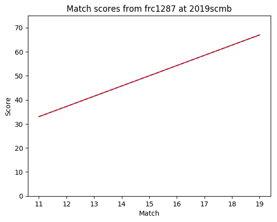

[Return to top](#at-a-glance)

### 1293, Pandamaniacs

**OPR**: 22.9621

**Team Capabilities**:

| low hatch | low cargo | high hatch | high cargo | average climb level |
| :---: | :---: | :---: | :---: | --- |
|  |  |  |  | 0.909 |

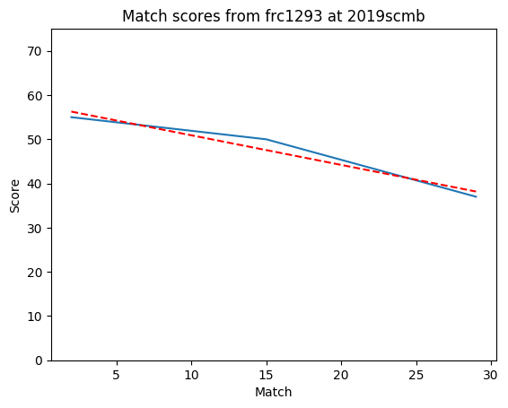

[Return to top](#at-a-glance)

### 1369, Minotaur

**OPR**: 18.4528

**Team Capabilities**:

| low hatch | low cargo | high hatch | high cargo | average climb level |
| :---: | :---: | :---: | :---: | --- |
|  |  |  |  | 1.3 |

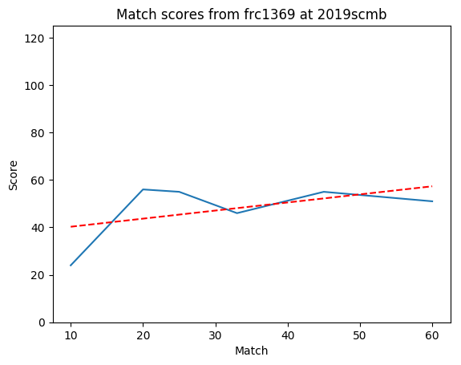

[Return to top](#at-a-glance)

### 1398, Robo-Raiders

**OPR**: 11.9598

**Team Capabilities**:

| low hatch | low cargo | high hatch | high cargo | average climb level |
| :---: | :---: | :---: | :---: | --- |
|  |  |  |  | 0.667 |

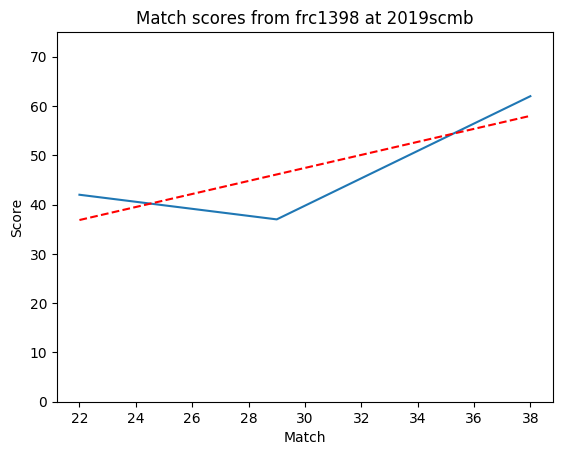

[Return to top](#at-a-glance)

### 1539, Clover Robotics

**OPR**: 13.3009

**Team Capabilities**:

| low hatch | low cargo | high hatch | high cargo | average climb level |
| :---: | :---: | :---: | :---: | --- |
|  |  |  |  | 0.667 |

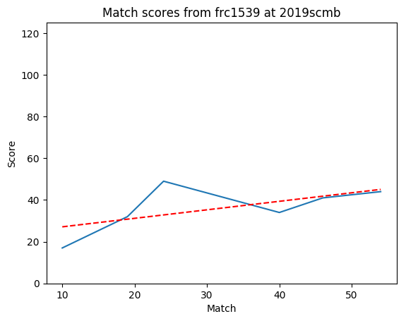

[Return to top](#at-a-glance)

### 1553, KC Robotics Team

**OPR**: 9.0401

**Team Capabilities**:

| low hatch | low cargo | high hatch | high cargo | average climb level |
| :---: | :---: | :---: | :---: | --- |
|  |  |  |  | 1.0 |

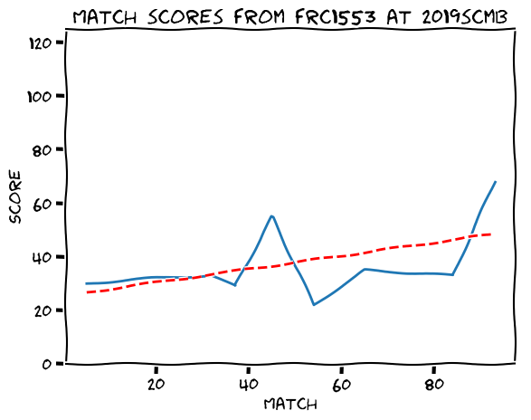

[Return to top](#at-a-glance)

### 1758, Technomancers

**OPR**: 2.1269

**Team Capabilities**:

| low hatch | low cargo | high hatch | high cargo | average climb level |
| :---: | :---: | :---: | :---: | --- |
|  |  |  |  | 0.333 |

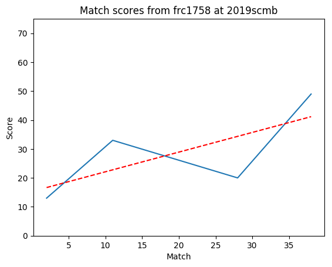

[Return to top](#at-a-glance)

### 1902, Exploding Bacon

**OPR**: 23.2361

**Team Capabilities**:

| low hatch | low cargo | high hatch | high cargo | average climb level |
| :---: | :---: | :---: | :---: | --- |
|  |  |  |  | 0.786 |

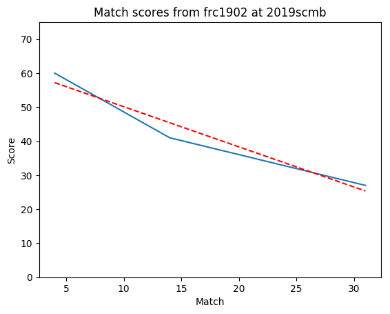

[Return to top](#at-a-glance)

### 21, ComBBAT

**OPR**: 20.5214

**Team Capabilities**:

| low hatch | low cargo | high hatch | high cargo | average climb level |
| :---: | :---: | :---: | :---: | --- |
|  |  |  |  | 1.778 |

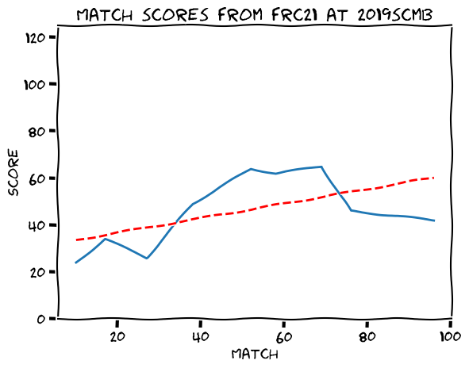

[Return to top](#at-a-glance)

### 2187, Team Volt

**OPR**: 10.0629

**Team Capabilities**:

| low hatch | low cargo | high hatch | high cargo | average climb level |
| :---: | :---: | :---: | :---: | --- |
|  |  |  |  | 1.0 |

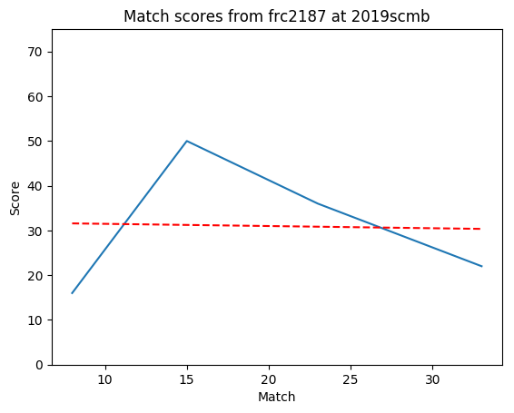

[Return to top](#at-a-glance)

### 2393, Robotichauns

**OPR**: 20.4503

**Team Capabilities**:

| low hatch | low cargo | high hatch | high cargo | average climb level |
| :---: | :---: | :---: | :---: | --- |
|  |  |  |  | 2.182 |

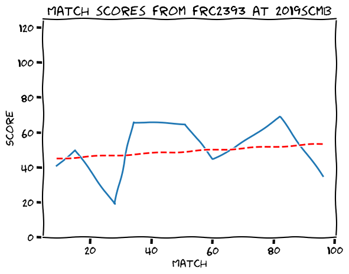

[Return to top](#at-a-glance)

### 2614, Mountaineer Area RoboticS (MARS)

**OPR**: 13.9302

**Team Capabilities**:

| low hatch | low cargo | high hatch | high cargo | average climb level |
| :---: | :---: | :---: | :---: | --- |
|  |  |  |  | 1.278 |

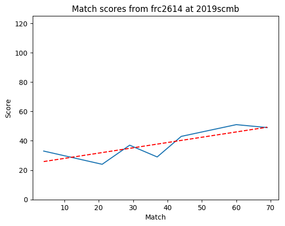

[Return to top](#at-a-glance)

### 263, Aftershock

**OPR**: 15.2929

**Team Capabilities**:

| low hatch | low cargo | high hatch | high cargo | average climb level |
| :---: | :---: | :---: | :---: | --- |
|  |  |  |  | 1.0 |

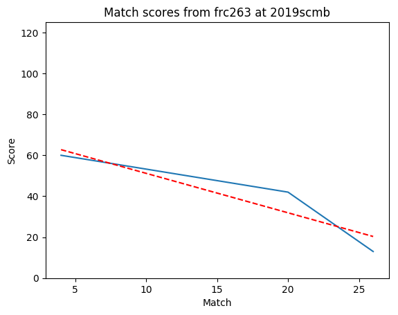

[Return to top](#at-a-glance)

### 281, The GreenVillains

**OPR**: 19.1302

**Team Capabilities**:

| low hatch | low cargo | high hatch | high cargo | average climb level |
| :---: | :---: | :---: | :---: | --- |
|  |  |  |  | 1.8 |

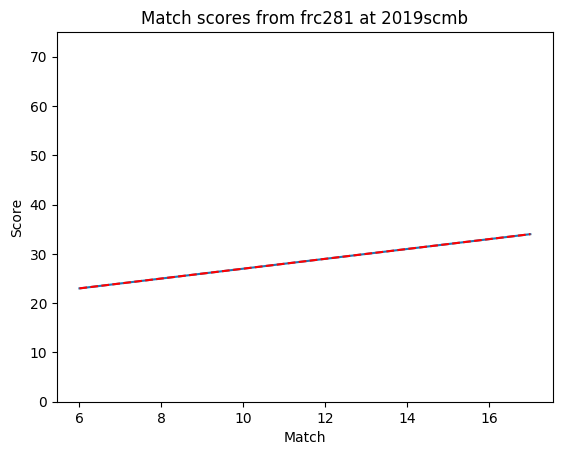

[Return to top](#at-a-glance)

### 2815, Blue Devil Mechanics

**OPR**: 10.6411

**Team Capabilities**:

| low hatch | low cargo | high hatch | high cargo | average climb level |
| :---: | :---: | :---: | :---: | --- |
|  |  |  |  | 0.778 |

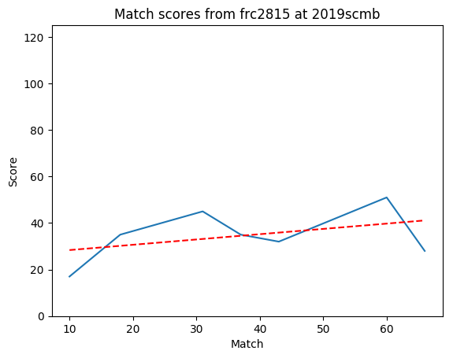

[Return to top](#at-a-glance)

### 283, The Generals

**OPR**: 5.6826

**Team Capabilities**:

| low hatch | low cargo | high hatch | high cargo | average climb level |
| :---: | :---: | :---: | :---: | --- |
|  |  |  |  | 0.778 |

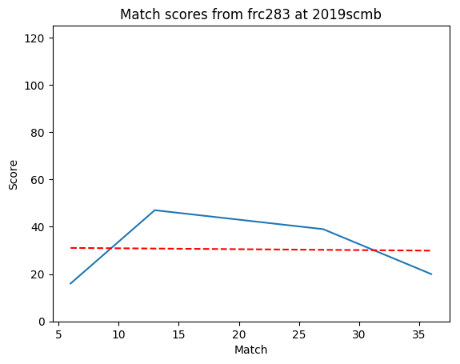

[Return to top](#at-a-glance)

### 3140, Flagship

**OPR**: 14.4384

**Team Capabilities**:

| low hatch | low cargo | high hatch | high cargo | average climb level |
| :---: | :---: | :---: | :---: | --- |
|  |  |  |  | 0.778 |

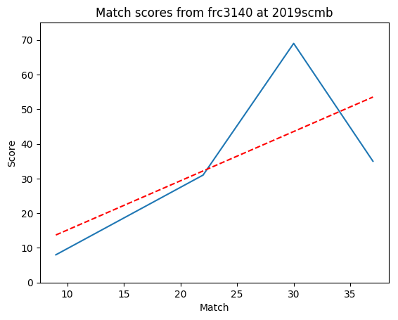

[Return to top](#at-a-glance)

### 342, Burning Magnetos

**OPR**: 22.2663

**Team Capabilities**:

| low hatch | low cargo | high hatch | high cargo | average climb level |
| :---: | :---: | :---: | :---: | --- |
|  |  |  |  | 1.0 |

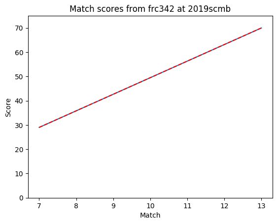

[Return to top](#at-a-glance)

### 3489, Category 5

**OPR**: 8.9369

**Team Capabilities**:

| low hatch | low cargo | high hatch | high cargo | average climb level |
| :---: | :---: | :---: | :---: | --- |
|  |  |  |  | 0.667 |

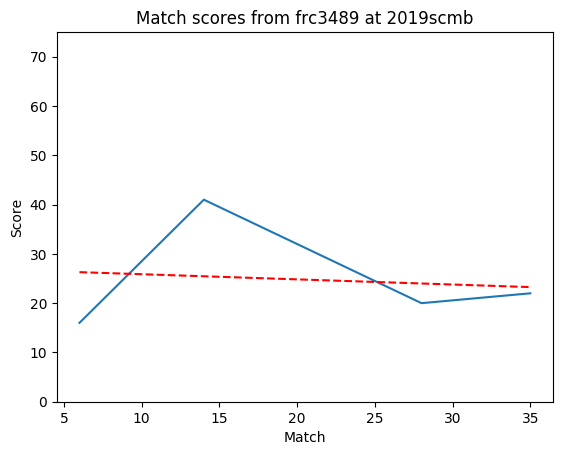

[Return to top](#at-a-glance)

### 3490, Viper Drive

**OPR**: 19.9782

**Team Capabilities**:

| low hatch | low cargo | high hatch | high cargo | average climb level |
| :---: | :---: | :---: | :---: | --- |
|  |  |  |  | 2.615 |

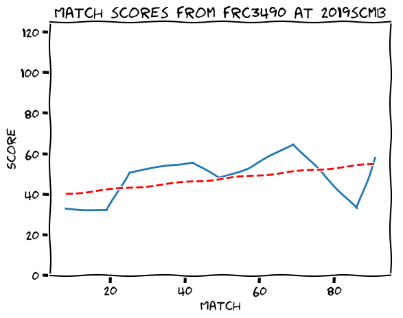

[Return to top](#at-a-glance)

### 3651, TRIBE

**OPR**: 3.7509

**Team Capabilities**:

| low hatch | low cargo | high hatch | high cargo | average climb level |
| :---: | :---: | :---: | :---: | --- |
|  |  |  |  | 0.889 |

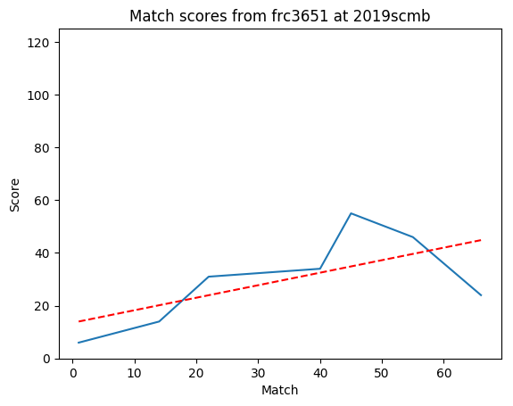

[Return to top](#at-a-glance)

### 379, The RoboCats

**OPR**: 27.2649

**Team Capabilities**:

| low hatch | low cargo | high hatch | high cargo | average climb level |
| :---: | :---: | :---: | :---: | --- |
|  |  |  |  | 2.278 |

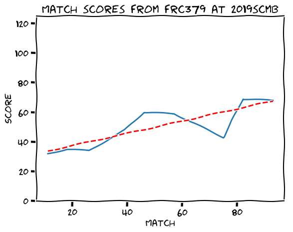

[Return to top](#at-a-glance)

### 3824, HVA RoHAWKtics

**OPR**: 16.1357

**Team Capabilities**:

| low hatch | low cargo | high hatch | high cargo | average climb level |
| :---: | :---: | :---: | :---: | --- |
|  |  |  |  | 1.278 |

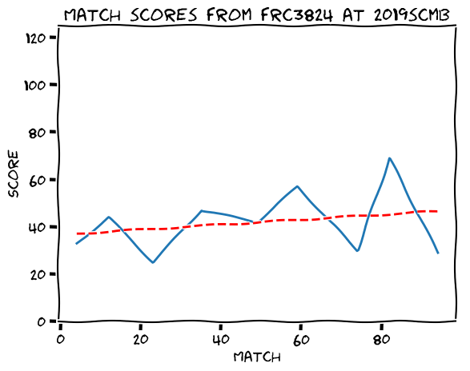

[Return to top](#at-a-glance)

### 3976, Electric Hornets

**OPR**: 9.9877

**Team Capabilities**:

| low hatch | low cargo | high hatch | high cargo | average climb level |
| :---: | :---: | :---: | :---: | --- |
|  |  |  |  | 1.0 |

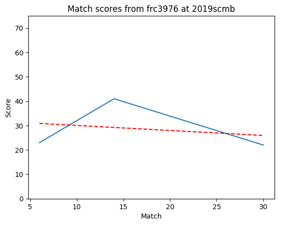

[Return to top](#at-a-glance)

### 4005, Hostile Gato Robotics

**OPR**: 25.7193

**Team Capabilities**:

| low hatch | low cargo | high hatch | high cargo | average climb level |
| :---: | :---: | :---: | :---: | --- |
|  |  |  |  | 0.636 |

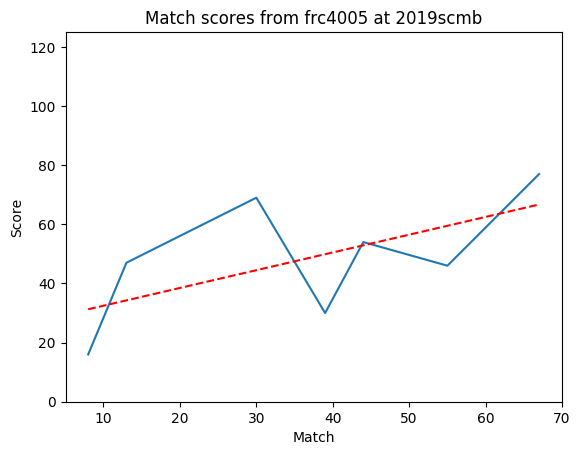

[Return to top](#at-a-glance)

### 4020, Cyber Tribe

**OPR**: 27.3034

**Team Capabilities**:

| low hatch | low cargo | high hatch | high cargo | average climb level |
| :---: | :---: | :---: | :---: | --- |
|  |  |  |  | 2.688 |

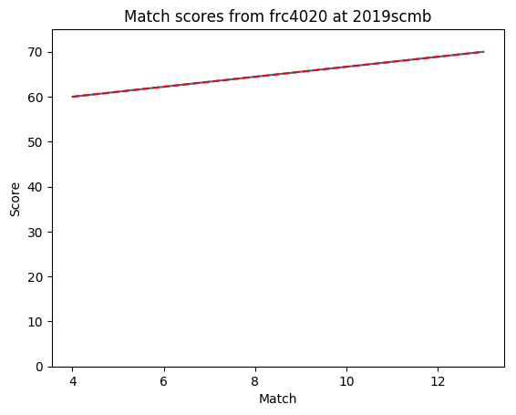

[Return to top](#at-a-glance)

### 4073, Robo Katz

**OPR**: 10.7318

**Team Capabilities**:

| low hatch | low cargo | high hatch | high cargo | average climb level |
| :---: | :---: | :---: | :---: | --- |
|  |  |  |  | 1.444 |

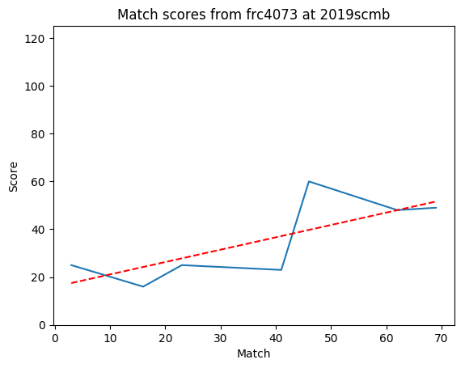

[Return to top](#at-a-glance)

### 4074, Shark Bytes

**OPR**: 4.8163

**Team Capabilities**:

| low hatch | low cargo | high hatch | high cargo | average climb level |
| :---: | :---: | :---: | :---: | --- |
|  |  |  |  | 0.778 |

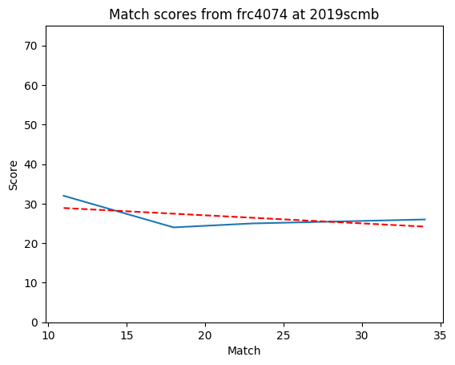

[Return to top](#at-a-glance)

### 4075, Robo Tigers

**OPR**: 2.8304

**Team Capabilities**:

| low hatch | low cargo | high hatch | high cargo | average climb level |
| :---: | :---: | :---: | :---: | --- |
|  |  |  |  | 0.889 |

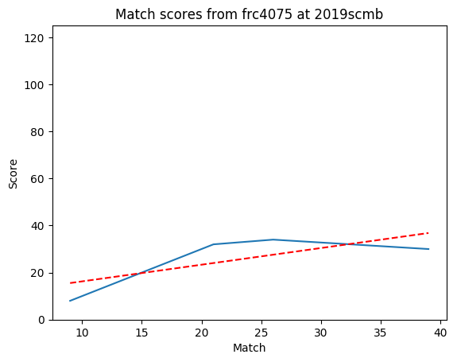

[Return to top](#at-a-glance)

### 4083, The Iron Wolverines

**OPR**: 3.8395

**Team Capabilities**:

| low hatch | low cargo | high hatch | high cargo | average climb level |
| :---: | :---: | :---: | :---: | --- |
|  |  |  |  | 0.889 |

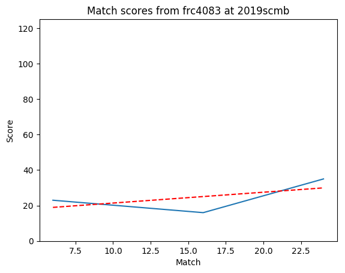

[Return to top](#at-a-glance)

### 4187, RoboRams

**OPR**: 4.7473

**Team Capabilities**:

| low hatch | low cargo | high hatch | high cargo | average climb level |
| :---: | :---: | :---: | :---: | --- |
|  |  |  |  | 0.222 |

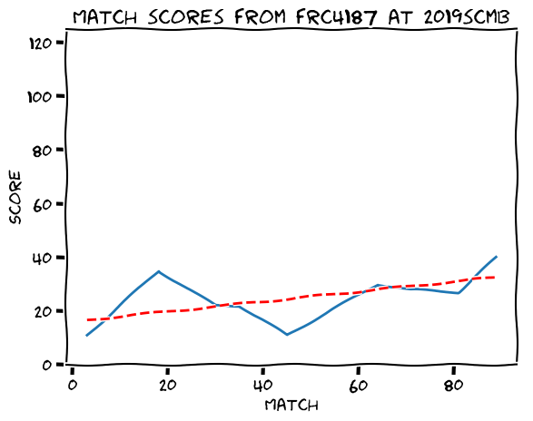

[Return to top](#at-a-glance)

### 4243, Excelsior!

**OPR**: 0.4606

**Team Capabilities**:

| low hatch | low cargo | high hatch | high cargo | average climb level |
| :---: | :---: | :---: | :---: | --- |
|  |  |  |  | 0.111 |

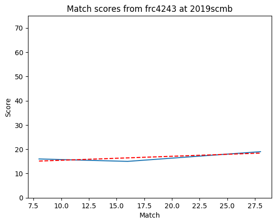

[Return to top](#at-a-glance)

### 4267, Brave Bots

**OPR**: 4.0306

**Team Capabilities**:

| low hatch | low cargo | high hatch | high cargo | average climb level |
| :---: | :---: | :---: | :---: | --- |
|  |  |  |  | 0.556 |

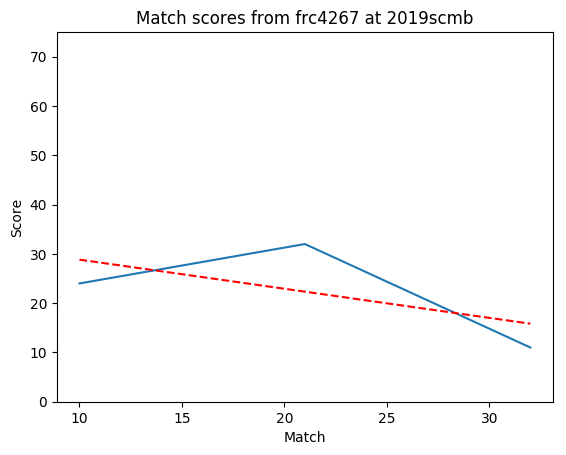

[Return to top](#at-a-glance)

### 4451, ROBOTZ Garage

**OPR**: 26.9911

**Team Capabilities**:

| low hatch | low cargo | high hatch | high cargo | average climb level |
| :---: | :---: | :---: | :---: | --- |
|  |  |  |  | 1.812 |

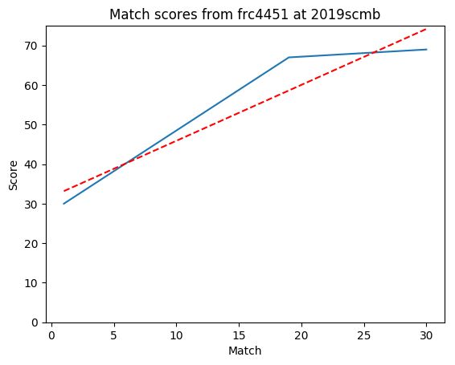

[Return to top](#at-a-glance)

### 4504, B. C. Robotics

**OPR**: 12.8325

**Team Capabilities**:

| low hatch | low cargo | high hatch | high cargo | average climb level |
| :---: | :---: | :---: | :---: | --- |
|  |  |  |  | 0.556 |

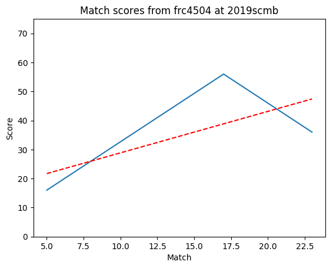

[Return to top](#at-a-glance)

### 4582, Robohawks 

**OPR**: 16.3074

**Team Capabilities**:

| low hatch | low cargo | high hatch | high cargo | average climb level |
| :---: | :---: | :---: | :---: | --- |
|  |  |  |  | 0.556 |

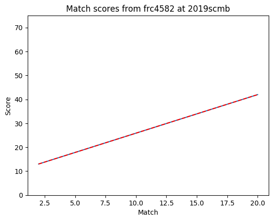

[Return to top](#at-a-glance)

### 4748, Bulldog Autobots

**OPR**: 11.8185

**Team Capabilities**:

| low hatch | low cargo | high hatch | high cargo | average climb level |
| :---: | :---: | :---: | :---: | --- |
|  |  |  |  | 0.444 |

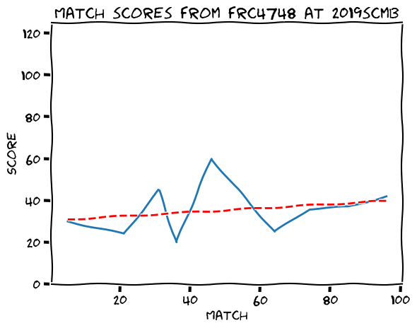

[Return to top](#at-a-glance)

### 4823, Metal Manes

**OPR**: 3.2635

**Team Capabilities**:

| low hatch | low cargo | high hatch | high cargo | average climb level |
| :---: | :---: | :---: | :---: | --- |
|  |  |  |  | 1.111 |

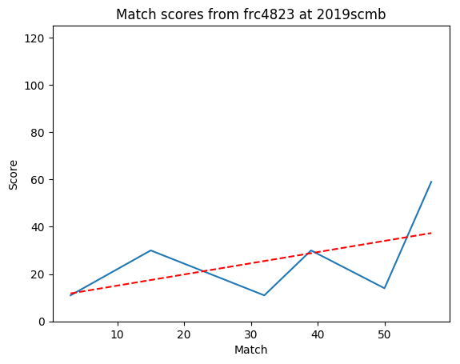

[Return to top](#at-a-glance)

### 4847, Techno-Logic Trojans

**OPR**: 1.0112

**Team Capabilities**:

| low hatch | low cargo | high hatch | high cargo | average climb level |
| :---: | :---: | :---: | :---: | --- |
|  |  |  |  | 0.111 |

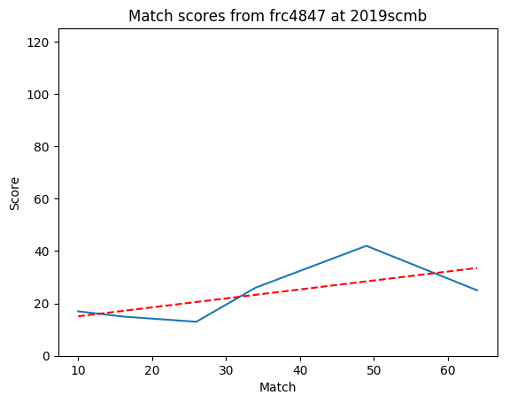

[Return to top](#at-a-glance)

### 4965, FIRE

**OPR**: 17.8511

**Team Capabilities**:

| low hatch | low cargo | high hatch | high cargo | average climb level |
| :---: | :---: | :---: | :---: | --- |
|  |  |  |  | 0.818 |

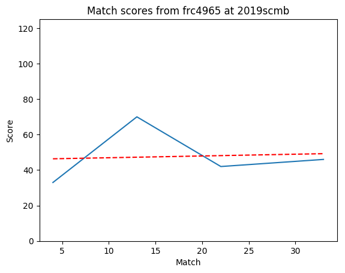

[Return to top](#at-a-glance)

### 5022, Rat Rod Robotics

**OPR**: 14.9021

**Team Capabilities**:

| low hatch | low cargo | high hatch | high cargo | average climb level |
| :---: | :---: | :---: | :---: | --- |
|  |  |  |  | 0.812 |

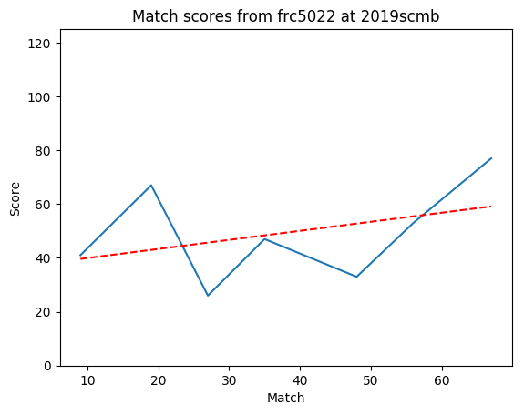

[Return to top](#at-a-glance)

### 5063, BuzzBots

**OPR**: 3.568

**Team Capabilities**:

| low hatch | low cargo | high hatch | high cargo | average climb level |
| :---: | :---: | :---: | :---: | --- |
|  |  |  |  | 0.556 |

[Return to top](#at-a-glance)

### 5130, Undercogs

**OPR**: 8.4575

**Team Capabilities**:

| low hatch | low cargo | high hatch | high cargo | average climb level |
| :---: | :---: | :---: | :---: | --- |
|  |  |  |  | 0.444 |

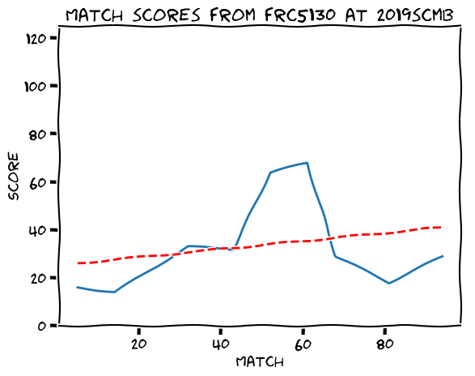

[Return to top](#at-a-glance)

### 5317, @RedhawkRobotics

**OPR**: 14.4317

**Team Capabilities**:

| low hatch | low cargo | high hatch | high cargo | average climb level |
| :---: | :---: | :---: | :---: | --- |
|  |  |  |  | 0.778 |

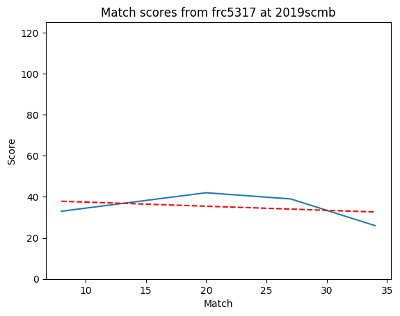

[Return to top](#at-a-glance)

### 5327, Griffin Robotics

**OPR**: 5.5503

**Team Capabilities**:

| low hatch | low cargo | high hatch | high cargo | average climb level |
| :---: | :---: | :---: | :---: | --- |
|  |  |  |  | 0.556 |

[Return to top](#at-a-glance)

### 5410, Eaglebotics

**OPR**: 8.8751

**Team Capabilities**:

| low hatch | low cargo | high hatch | high cargo | average climb level |
| :---: | :---: | :---: | :---: | --- |
|  |  |  |  | 1.556 |

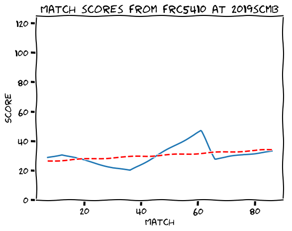

[Return to top](#at-a-glance)

### 5472, Stallion Robotics

**OPR**: 22.1467

**Team Capabilities**:

| low hatch | low cargo | high hatch | high cargo | average climb level |
| :---: | :---: | :---: | :---: | --- |
|  |  |  |  | 1.091 |

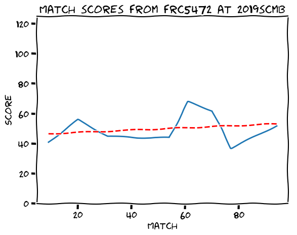

[Return to top](#at-a-glance)

### 5777, Static Storm

**OPR**: 2.1599

**Team Capabilities**:

| low hatch | low cargo | high hatch | high cargo | average climb level |
| :---: | :---: | :---: | :---: | --- |
|  |  |  |  | 0.667 |

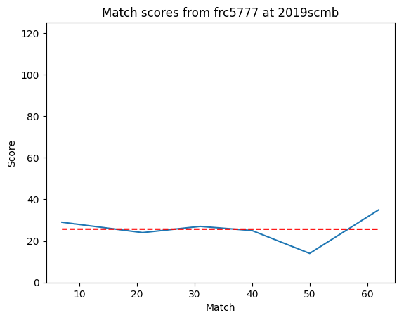

[Return to top](#at-a-glance)

### 5949, TechGarage

**OPR**: 21.2554

**Team Capabilities**:

| low hatch | low cargo | high hatch | high cargo | average climb level |
| :---: | :---: | :---: | :---: | --- |
|  |  |  |  | 0.556 |

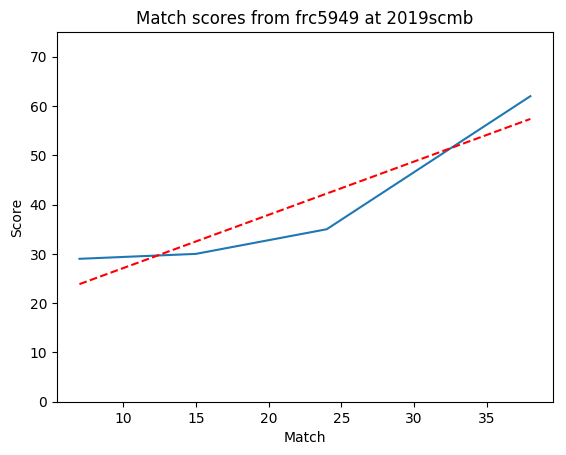

[Return to top](#at-a-glance)

### 6167, CB Bearbots

**OPR**: 10.0957

**Team Capabilities**:

| low hatch | low cargo | high hatch | high cargo | average climb level |
| :---: | :---: | :---: | :---: | --- |
|  |  |  |  | 0.556 |

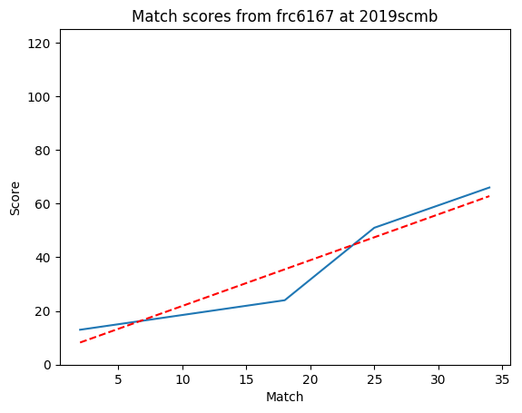

[Return to top](#at-a-glance)

### 6222, Flying Tigers

**OPR**: 10.3232

**Team Capabilities**:

| low hatch | low cargo | high hatch | high cargo | average climb level |
| :---: | :---: | :---: | :---: | --- |
|  |  |  |  | 1.273 |

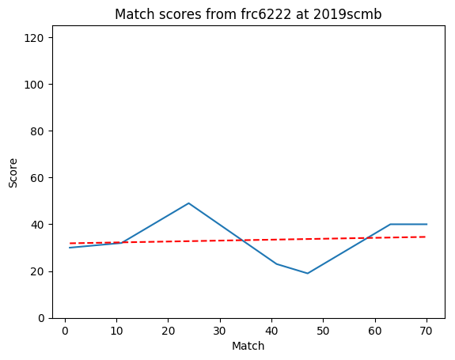

[Return to top](#at-a-glance)

### 6366, RAM Rodz Robotics

**OPR**: 14.2034

**Team Capabilities**:

| low hatch | low cargo | high hatch | high cargo | average climb level |
| :---: | :---: | :---: | :---: | --- |
|  |  |  |  | 1.462 |

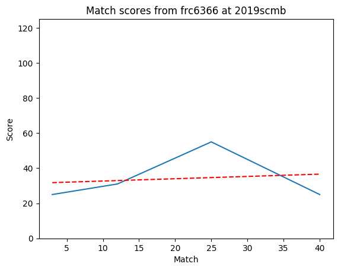

[Return to top](#at-a-glance)

### 6626, Robohana

**OPR**: 12.7299

**Team Capabilities**:

| low hatch | low cargo | high hatch | high cargo | average climb level |
| :---: | :---: | :---: | :---: | --- |
|  |  |  |  | 1.333 |

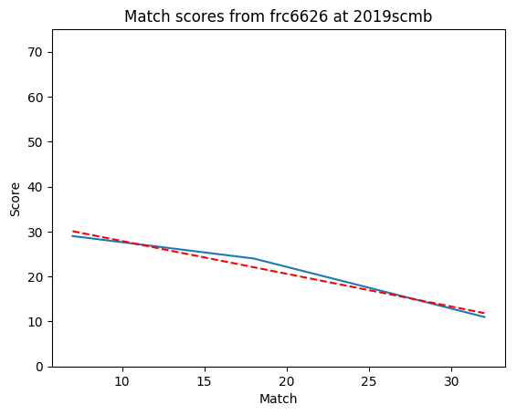

[Return to top](#at-a-glance)

### 6961, SIbots

**OPR**: 4.3674

**Team Capabilities**:

| low hatch | low cargo | high hatch | high cargo | average climb level |
| :---: | :---: | :---: | :---: | --- |
|  |  |  |  | 0.667 |

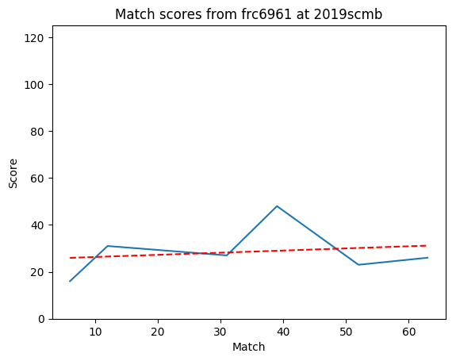

[Return to top](#at-a-glance)

### 7072, O.G.R.E. (Opelika's Greatest Robotics Engineers)

**OPR**: 19.366

**Team Capabilities**:

| low hatch | low cargo | high hatch | high cargo | average climb level |
| :---: | :---: | :---: | :---: | --- |
|  |  |  |  | 1.091 |

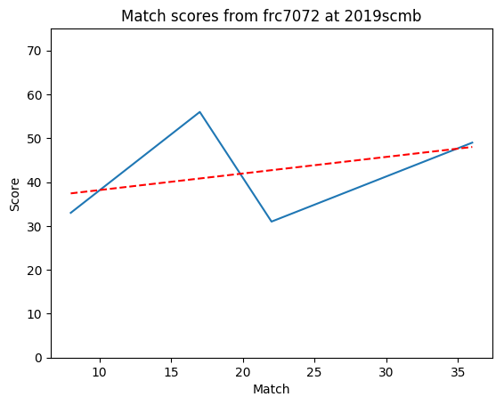

[Return to top](#at-a-glance)

### 7085, Waccamaw High School

**OPR**: 12.444

**Team Capabilities**:

| low hatch | low cargo | high hatch | high cargo | average climb level |
| :---: | :---: | :---: | :---: | --- |
|  |  |  |  | 1.0 |

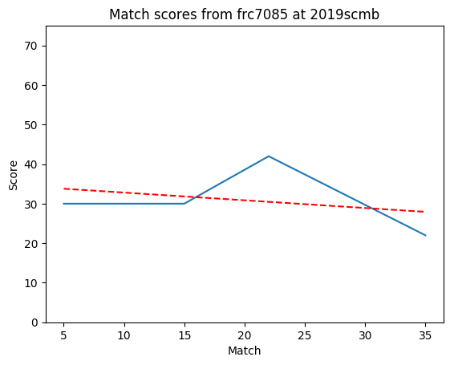

[Return to top](#at-a-glance)

### 7107, Blazer Robotics

**OPR**: 7.0363

**Team Capabilities**:

| low hatch | low cargo | high hatch | high cargo | average climb level |
| :---: | :---: | :---: | :---: | --- |
|  |  |  |  | 1.0 |

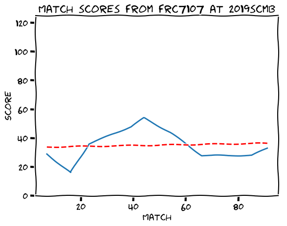

[Return to top](#at-a-glance)

### 7152, Owltonomous

**OPR**: 21.2045

**Team Capabilities**:

| low hatch | low cargo | high hatch | high cargo | average climb level |
| :---: | :---: | :---: | :---: | --- |
|  |  |  |  | 1.727 |

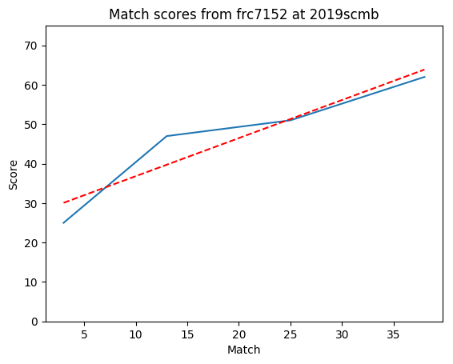

[Return to top](#at-a-glance)

### 7409, GLOW

**OPR**: 10.5786

**Team Capabilities**:

| low hatch | low cargo | high hatch | high cargo | average climb level |
| :---: | :---: | :---: | :---: | --- |
|  |  |  |  | 0.778 |

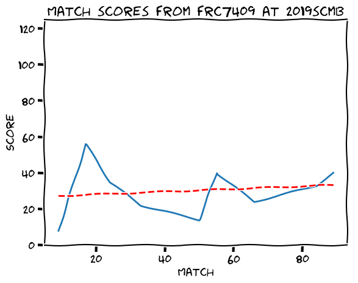

[Return to top](#at-a-glance)

### 7489, Milagro Center

**OPR**: 6.7695

**Team Capabilities**:

| low hatch | low cargo | high hatch | high cargo | average climb level |
| :---: | :---: | :---: | :---: | --- |
|  |  |  |  | 0.222 |

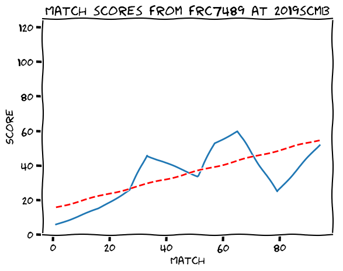

[Return to top](#at-a-glance)

### 86, Team Resistance

**OPR**: 25.7432

**Team Capabilities**:

| low hatch | low cargo | high hatch | high cargo | average climb level |
| :---: | :---: | :---: | :---: | --- |
|  |  |  |  | 1.857 |

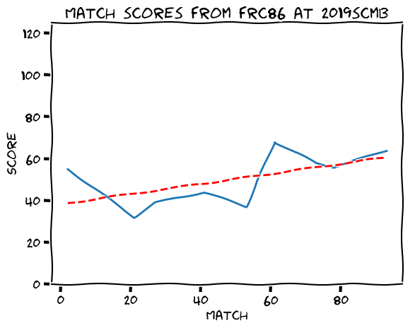

[Return to top](#at-a-glance)

### 900, The Zebracorns

**OPR**: 8.2121

**Team Capabilities**:

| low hatch | low cargo | high hatch | high cargo | average climb level |
| :---: | :---: | :---: | :---: | --- |
| X | X |  |  | 0.778 |

[Return to top](#at-a-glance)