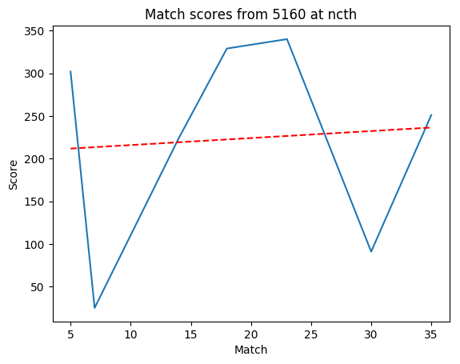

# Sakurajima Scouting

## Welcome

This is intended to be a scouting application for the 2019 FRC game, Destination Deep Space.

It will contain rankings as well as statistics and graphs for various teams competing at FRC competitions.

Don't expect for it to have to many updates except during competitions.

Hopefully most of this will be auto generated as needed to make things easier for me.

Source code can be found [here](https://github.com/morzack/Sakurajima-Scouting).

Message me at @Valis#7360 on Discord for more information.

## At a glance: The best teams

* 254

## In depth

### 5160 | The Chargers

#### THOR

