## Welcome

This is intended to be a scouting application for the 2019 FRC game, Destination Deep Space.
It will contain rankings as well as statistics and graphs for various teams competing at FRC competitions.
Don't expect for it to have to many updates except during competitions.
Hopefully most of this will be auto generated as needed to make things easier for me.

Source code can be found [here](https://github.com/morzack/Sakurajima-Scouting).

Message me at @Valis#7360 on Discord for more information.

## At a Glance

### Top OPR Teams

- [Team 1102: M'Aiken Magic ](#1102-m'aiken-magic), 211.96123071643552
- [Team 3196: Team SPORK](#3196-team-spork), 164.34715964760943
- [Team 1533: Triple Strange](#1533-triple-strange), 160.4891249815323
- [Team 3229: Hawktimus Prime](#3229-hawktimus-prime), 159.09974832020038
- [Team 5724: Spartan Robotics](#5724-spartan-robotics), 149.18724704100228
- [Team 5511: Cortechs Robotics](#5511-cortechs-robotics), 147.3921467891091
- [Team 2655: The Flying Platypi](#2655-the-flying-platypi), 146.02255226509658
- [Team 1225: The Gorillas](#1225-the-gorillas), 116.90550143297604
- [Team 5190: Green Hope Falcons](#5190-green-hope-falcons), 110.4846042216071
- [Team 5679: Girls on Fire](#5679-girls-on-fire), 109.08782712445154
- [Team 3459: Team PyroTech](#3459-team-pyrotech), 104.57190858466373
- [Team 6500: GearCats](#6500-gearcats), 104.26201162028394
- [Team 2059: The Hitchhikers](#2059-the-hitchhikers), 103.954959972872
- [Team 6888: Cav-A-Gears](#6888-cav-a-gears), 98.50067581634538
- [Team 4829: Titanium Tigers](#4829-titanium-tigers), 91.70032399423843
- [Team 6894: Iced Java](#6894-iced-java), 83.41283042926429
- [Team 3737: Roto-Raptors](#3737-roto-raptors), 82.58111221923667
- [Team 4561: TerrorBytes](#4561-terrorbytes), 81.7403062138067
- [Team 587: Hedgehogs](#587-hedgehogs), 78.9051744815126
- [Team 2640: HOTBOTZ](#2640-hotbotz), 74.55016247550336
- [Team 6004: f(x) Robotics](#6004-f(x)-robotics), 70.62980119883079
- [Team 5762: FranklinBots](#5762-franklinbots), 59.60216392304515
- [Team 5160: Chargers](#5160-chargers), 49.60406075708984
- [Team 4290: Bots of War](#4290-bots-of-war), 49.10871939455389
- [Team 9999: Off-Season Demo Team](#9999-off-season-demo-team), 48.495669808834165
- [Team 5518: Techno Wolves](#5518-techno-wolves), 39.94263505787065
- [Team 3506: YETI Robotics](#3506-yeti-robotics), 36.49237049449907
- [Team 3661: RoboWolves](#3661-robowolves), 30.477299070106774
- [Team 4935: T-Rex](#4935-t-rex), 29.94765026516298
- [Team 4816: Gadget Girls](#4816-gadget-girls), -34.02840688916817

## In depth

### 1102, M'Aiken Magic 

OPR: 211.96123071643552

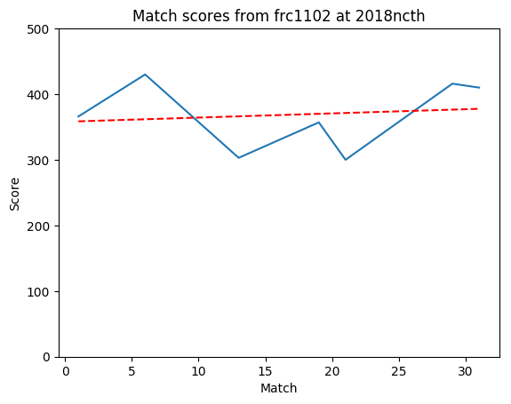

### 1225, The Gorillas

OPR: 116.90550143297604

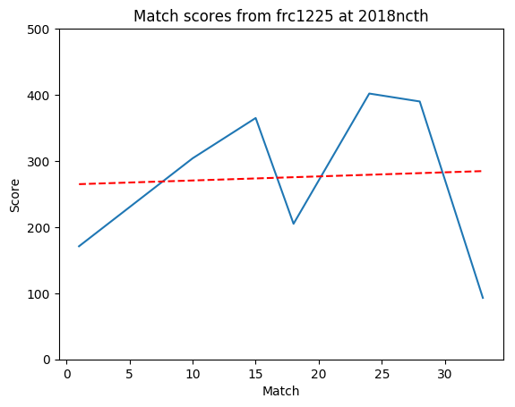

### 1533, Triple Strange

OPR: 160.4891249815323

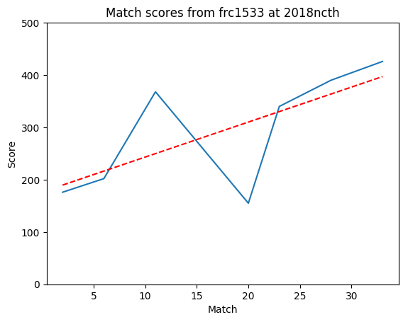

### 2059, The Hitchhikers

OPR: 103.954959972872

### 2640, HOTBOTZ

OPR: 74.55016247550336

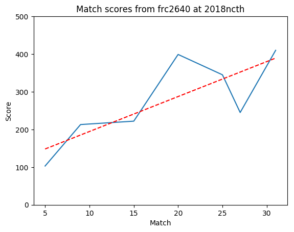

### 2655, The Flying Platypi

OPR: 146.02255226509658

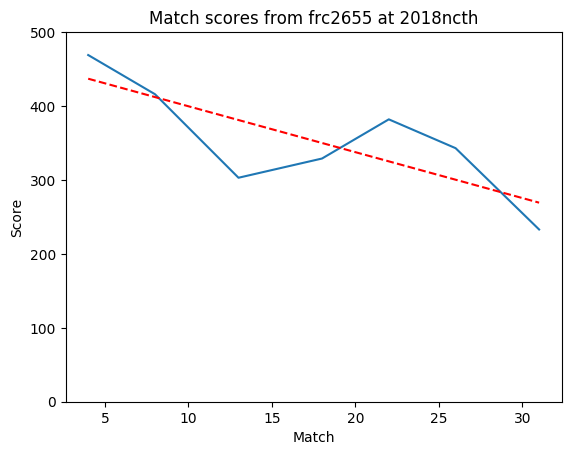

### 3196, Team SPORK

OPR: 164.34715964760943

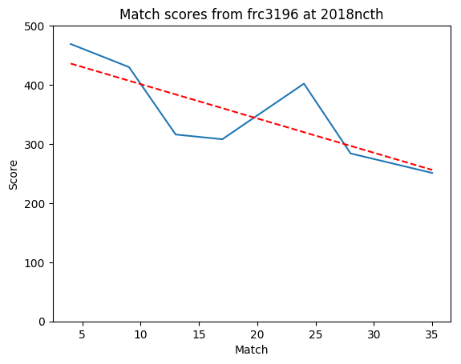

### 3229, Hawktimus Prime

OPR: 159.09974832020038

### 3459, Team PyroTech

OPR: 104.57190858466373

### 3506, YETI Robotics

OPR: 36.49237049449907

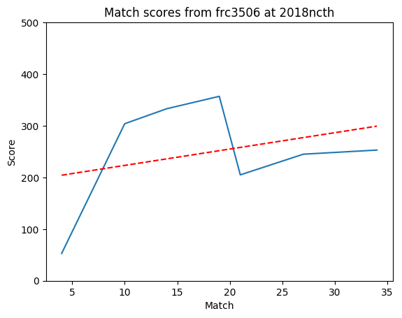

### 3661, RoboWolves

OPR: 30.477299070106774

### 3737, Roto-Raptors

OPR: 82.58111221923667

### 4290, Bots of War

OPR: 49.10871939455389

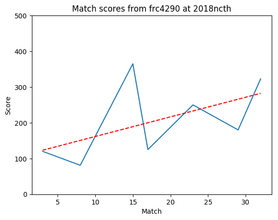

### 4561, TerrorBytes

OPR: 81.7403062138067

### 4816, Gadget Girls

OPR: -34.02840688916817

### 4829, Titanium Tigers

OPR: 91.70032399423843

### 4935, T-Rex

OPR: 29.94765026516298

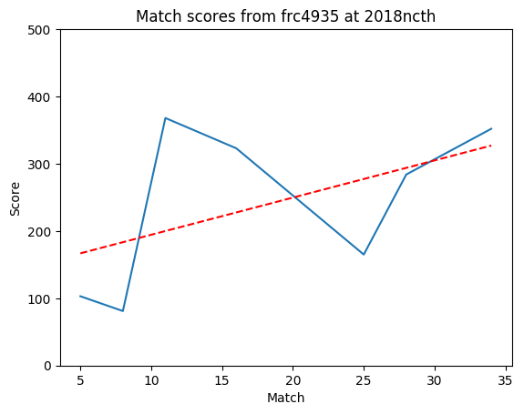

### 5160, Chargers

OPR: 49.60406075708984

### 5190, Green Hope Falcons

OPR: 110.4846042216071

### 5511, Cortechs Robotics

OPR: 147.3921467891091

### 5518, Techno Wolves

OPR: 39.94263505787065

### 5679, Girls on Fire

OPR: 109.08782712445154

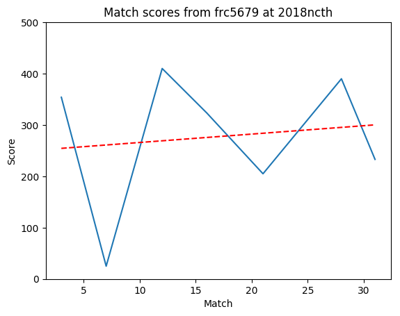

### 5724, Spartan Robotics

OPR: 149.18724704100228

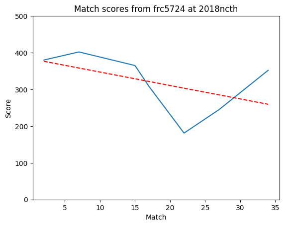

### 5762, FranklinBots

OPR: 59.60216392304515

### 587, Hedgehogs

OPR: 78.9051744815126

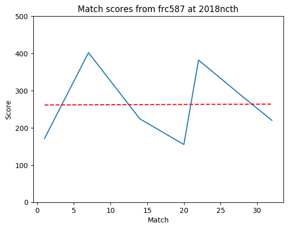

### 6004, f(x) Robotics

OPR: 70.62980119883079

### 6500, GearCats

OPR: 104.26201162028394

### 6888, Cav-A-Gears

OPR: 98.50067581634538

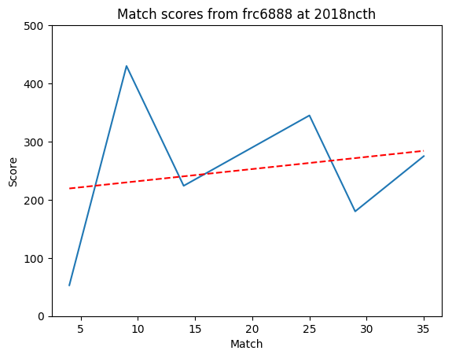

### 6894, Iced Java

OPR: 83.41283042926429

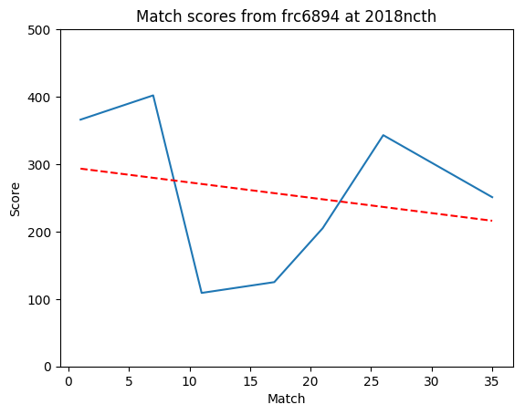

### 9999, Off-Season Demo Team

OPR: 48.495669808834165

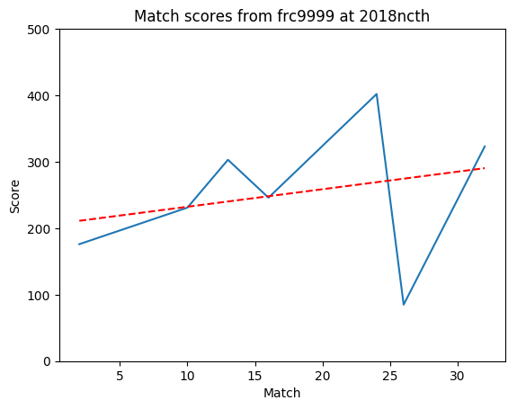